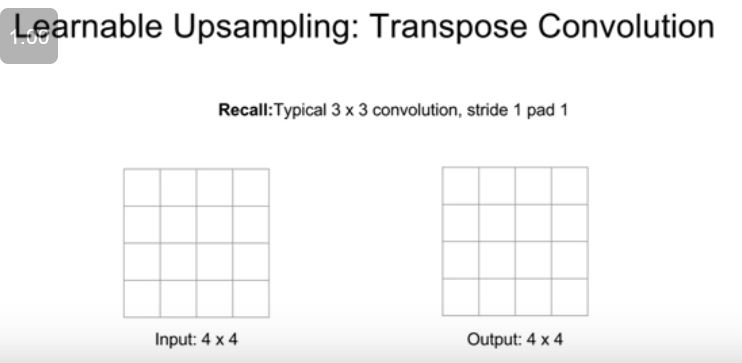

## Segmentation, localisation , detection

One approach to semantic segmentation is classification

So there's this, you could use this idea of a sliding window approach to semantic segmentation. So you might imagine that we take our input image and we break it up into many many small, tiny local crops of the image so in this example we've taken maybe three crops from around the head of this cow and then you could imagine taking each of those crops and now treating this as a classification problem. Saying for this crop, what is the category of the central pixel of the crop? And then we could use all the same machinery that we've developed for classifying entire images but now just apply it on crops rather than on the entire image. And this would probably work to some extent but it's probably not a very good idea. So this would end up being super super computationally expensive because we want to label every pixel in the image, we would need a separate crop for every pixel in that image and this would be super super expensive to run forward and backward passes through. And moreover, we're actually, if you think about this we can actually share computation between different patches so if you're trying to classify two patches that are right next to each other and actually overlap then the convolutional features of those patches will end up going through the same convolutional layers and we can actually share a lot of the computation when applying this to separate passes or when applying this type of approach to separate patches in the image. So this is actually a terrible idea and nobody does this and you should probably not do this but it's at least the first thing you might think of if you were trying to think about semantic segmentation. 

A terrible idea not to do

each convolutional layer preserves the spatial size of the input and now if we pass our image through a whole stack of these convolutional layers, then the final convolutional layer could just output a tensor of something by C by H by W where C is the number of categories that we care about and you could see this tensor as just giving our classification scores for every pixel in the input image at every location in the input image. And we could compute this all at once with just some giant stack of convolutional layers. And then you could imagine training this thing by putting a classification loss at every pixel of this output, taking an average over those pixels in space, and just training this kind of network through normal, regular back propagation. 

Getting training data is very expensive.

So here since we're making a classification decision per pixel then we put a cross entropy loss on every pixel of the output. So we have the ground truth category label for every pixel in the output, then we compute across entropy loss between every pixel in the output and the ground truth pixels and then take either a sum or an average over space and then sum or average over the mini-batch. 

we do assume that we know the categories up front so this is just like the image classification case. 

Problem with this-

So in this setup, since we're applying a bunch of convolutions that are all keeping the same spatial size of the input image, this would be super super expensive right. If you wanted to do convolutions that maybe have 64 or 128 or 256 channels for those convolutional filters which is pretty common in a lot of these networks, then running those convolutions on this high resolution input image over a sequence of layers would be extremely computationally expensive and would take a ton of memory. So in practice, you don't usually see networks with this architecture. 

we have some downsampling and then some upsampling of the feature map inside the image. So rather than doing all the convolutions of the full spatial resolution of the image, we'll maybe go through a small number of convolutional layers at the original resolution then downsample that feature map using something like max pooling or strided convolutions and sort of downsample, downsample, so we have convolutions in downsampling and convolutions in downsampling that look much like a lot of the classification networks that you see but now the difference is that rather than transitioning to a fully connected layer like you might do in an image classification setup, instead we want to increase the spatial resolution of our predictions in the second half of the network so that our output image can now be the same size as our input image and this ends up being much more computationally efficient because you can make the network very deep and work at a lower spatial resolution for many of the layers at the inside of the network.

To downsample we can simply do pooling or introduce strides.

### Upsampling

And this is kind of like a bed of nails because the zeros are very flat, then you've got these things poking up for the values at these various non-zero regions. 

Oh yeah, so the question is why is this a good idea? Why might this matter? So the idea is that when we're doing semantic segmentation we want our predictions to be pixel perfect right. We kind of want to get those sharp boundaries and those tiny details in our predictive segmentation so now if you're doing this max pooling, there's this sort of heterogeneity that's happening inside the feature map due to the max pooling where from the low resolution image you don't know, you're sort of losing spatial information in some sense by you don't know where that feature vector came from in the local receptive field after max pooling. So if you actually unpool by putting the vector in the same slot you might think that that might help us handle these fine details a little bit better and help us preserve some of that spatial information that was lost during max pooling. 

And now a transpose convolution is sort of the opposite in a way so here our input will be a two by two region and our output will be a four by four region. But now the operation that we perform with transpose convolution is a little bit different. Now so rather than taking an inner product instead what we're going to do is we're going to take the value of our input feature map at that upper left hand corner and that'll be some scalar value in the upper left hand corner. We're going to multiply the filter by that scalar value and then copy those values over to this three by three region in the output so rather than taking an inner product with our filter and the input, instead our input gives weights that we will use to weight the filter and then our output will be weighted copies of the filter that are weighted by the values in the input. And now we can do this sort of same ratio trick in order to upsample so now when we move one pixel in the input now we can plop our filter down two pixels away in the output and it's the same trick that now the blue pixel in the input is some scalar value and we'll take that scalar value, multiply it by the values in the filter, and copy those weighted filter values into this new region in the output. The tricky part is that sometimes these receptive fields in the output can overlap now and now when these receptive fields in the output overlap we just sum the results in the output. So then you can imagine repeating this everywhere and repeating this process everywhere and this ends up doing sort of a learnable upsampling where we use these learned convolutional filter weights to upsample the image and increase the spatial size. 

x -> convolution
a -> input

Sometimes with this adding conflicting elements can be a problem.

## Classification and Localization

So again, we have our input image, we feed our input image through some giant convolutional network, this is Alex, this is AlexNet for example, which will give us some final vector summarizing the content of the image. Then just like before we'll have some fully connected layer that goes from that final vector to our class scores. But now we'll also have another fully connected layer that goes from that vector to four numbers. Where the four numbers are something like the height, the width, and the x and y positions of that bounding box. And now our network will produce these two different outputs, one is this set of class scores, and the other are these four numbers giving the coordinates of the bounding box in the input image. And now during training time, when we train this network we'll actually have two losses so in this scenario we're sort of assuming a fully supervised setting so we assume that each of our training images is annotated with both a category label and also a ground truth bounding box for that category in the image. So now we have two loss functions. We have our favorite softmax loss that we compute using the ground truth category label and the predicted class scores, and we also have some kind of loss that gives us some measure of dissimilarity between our predicted coordinates for the bounding box and our actual coordinates for the bounding box. So one very simple thing is to just take an L2 loss between those two and that's kind of the simplest thing that you'll see in practice although sometimes people play around with this and maybe use L1 or smooth L1 or they parametrize the bounding box a little bit differently but the idea is always the same, that you have some regression loss between your predicted bounding box coordinates and the ground truth bounding box coordinates. 

Yeah, so that's the question is do these losses have different units, do they dominate the gradient? So this is what we call a multi-task loss so whenever we're taking derivatives we always want to take derivative of a scalar with respect to our network parameters and use that derivative to take gradient steps. But now we've got two scalars that we want to both minimize so what you tend to do in practice is have some additional hyperparameter that gives you some weighting between these two losses so you'll take a weighted sum of these two different loss functions to give our final scalar loss. And then you'll take your gradients with respect to this weighted sum of the two losses. And this ends up being really really tricky because this weighting parameter is a hyperparameter that you need to set but it's kind of different from some of the other hyperparameters that we've seen so far in the past right because this weighting hyperparameter actually changes the value of the loss function so one thing that you might often look at when you're trying to set hyperparameters is you might make different hyperparameter choices and see what happens to the loss under different choices of hyperparameters. But in this case because the loss actually, because the hyperparameter affects the absolute value of the loss making those comparisons becomes kind of tricky. So setting that hyperparameter is somewhat difficult. And in practice, you kind of need to take it on a case by case basis for exactly the problem you're solving but my general strategy for this is to have some other metric of performance that you care about other than the actual loss value which then you actually use that final performance metric to make your cross validation choices rather than looking at the value of the loss to make those choices. 

So the question is what do I mean when I say regression loss? So I mean something other than cross entropy or softmax right. When I say regression loss I usually mean like an L2 Euclidean loss or an L1 loss or sometimes a smooth L1 loss. But in general classification versus regression is whether your output is categorical or continuous so if you're expecting a categorical output like you ultimately want to make a classification decision over some fixed number of categories then you'll think about a cross entropy loss, softmax loss or these SVM margin type losses that we talked about already in the class. But if your expected output is to be some continuous value, in this case the position of these points, then your output is continuous so you tend to use different types of losses in those situations. Typically an L2, L1, different kinds of things there. 

But the bigger point here is that for any time you know that you want to make some fixed number of outputs from your network, if you know for example. Maybe you knew that you wanted to, you knew that you always are going to have pictures of a cat and a dog and you want to predict both the bounding box of the cat and the bounding box of the dog in that case you'd know that you have a fixed number of outputs for each input so you might imagine hooking up this type of regression classification plus localization framework for that problem as well. So this idea of some fixed number of regression outputs can be applied to a lot of different problems including pose estimation

## Object Detection

But the idea in object detection is that we again start with some fixed set of categories that we care about, maybe cats and dogs and fish or whatever but some fixed set of categories that we're interested in. And now our task is that given our input image, every time one of those categories appears in the image, we want to draw a box around it and we want to predict the category of that box so this is different from classification plus localization because there might be a varying number of outputs for every input image. You don't know ahead of time how many objects you expect to find in each image so that's, this ends up being a pretty challenging problem. 

Okay, so as I already said this is different from localization because there might be differing numbers of objects for each image. So for example in this cat on the upper left there's only one object so we only need to predict four numbers but now for this image in the middle there's three animals there so we need our network to predict 12 numbers, four coordinates for each bounding box. Or in this example of many many ducks then you want your network to predict a whole bunch of numbers. Again, four numbers for each duck. So this is quite different from object detection. Sorry object detection is quite different from localization because in object detection you might have varying numbers of objects in the image and you don't know ahead of time how many you expect to find. So as a result, it's kind of tricky if you want to think of object detection as a regression problem. So instead, people tend to work, use kind of a different paradigm when thinking about object detection. 

So this is kind of similar to this idea of taking small patches and applying that for semantic segmentation and we can apply a similar idea for object detection. So the ideas is that we'll take different crops from the input image, in this case we've got this crop in the lower left hand corner of our image and now we take that crop, feed it through our convolutional network and our convolutional network does a classification decision on that input crop. It'll say that there's no dog here, there's no cat here, and then in addition to the categories that we care about we'll add an additional category called background and now our network can predict background in case it doesn't see any of the categories that we care about, so then when we take this crop from the lower left hand corner here then our network would hopefully predict background and say that no, there's no object here. Now if we take a different crop then our network would predict dog yes, cat no, background no. We take a different crop we get dog yes, cat no, background no. Or a different crop, dog no, cat yes, background no. 

Yeah, the question is how do you choose the crops? So this is a huge problem right. Because there could be any number of objects in this image, these objects could appear at any location in the image, these objects could appear at any size in the image, these objects could also appear at any aspect ratio in the image, so if you want to do kind of a brute force sliding window approach you'd end up having to test thousands, tens of thousands, many many many many different crops in order to tackle this problem with a brute force sliding window approach. And in the case where every one of those crops is going to be fed through a giant convolutional network, this would be completely computationally intractable. So in practice people don't ever do this sort of brute force sliding window approach for object detection using convolutional networks. Instead there's this cool line of work called region proposals that comes from, this is not using deep learning typically. 

Traditional image processing not a deep learning thingy.

So now rather than applying our classification network to every possible location and scale in the image instead what we can do is first apply one of these region proposal networks to get some set of proposal regions where objects are likely located and now apply a convolutional network for classification to each of these proposal regions and this will end up being much more computationally tractable than trying to do all possible locations and scales. 

And this idea all came together in this paper called R-CNN

in addition for each of these input region proposals because the problem is that your input region proposals are kind of generally in the right position for an object but they might not be perfect so in addition R-CNN will, in addition to category labels for each of these proposals, it'll also predict four numbers that are kind of an offset or a correction to the box that was predicted at the region proposal stage. So then again, this is a multi-task loss and you would train this whole thing. 

Yeah, so the question is what kind of data do we need and yeah, this is fully supervised in the sense that our training data has each image, consists of images. Each image has all the object categories marked with bounding boxes for each instance of that category. There are definitely papers that try to approach this like oh what if you don't have the data. What if you only have that data for some images? Or what if that data is noisy but at least in the generic case you assume full supervision of all objects in the images at training time. 

We're going to start with our input image but now rather than processing each region of interest separately instead we're going to run the entire image through some convolutional layers all at once to give this high resolution convolutional feature map corresponding to the entire image. And now we still are using some region proposals from some fixed thing like Selective Search but rather than cropping out the pixels of the image corresponding to the region proposals, instead we imagine projecting those region proposals onto this convolutional feature map and then taking crops from the convolutional feature map corresponding to each proposal rather than taking crops directly from the image. And this allows us to reuse a lot of this expensive convolutional computation across the entire image when we have many many crops per image. But again, if we have some fully connected layers downstream those fully connected layers are expecting some fixed-size input so now we need to do some reshaping of those crops from the convolutional feature map and they do that in a differentiable way using something they call an ROI pooling layer. Once you have these warped crops from the convolutional feature map then you can run these things through some fully connected layers and predict your classification scores and your linear regression offsets to the bounding boxes. And now when we train this thing then we again have a multi-task loss that trades off between these two constraints and during back propagation we can back prop through this entire thing and learn it all jointly. 

Yeah the question is how do you train this region proposal network because you don't know, you don't have ground truth region proposals for the region proposal network. So that's a little bit hairy. I don't want to get too much into those details but the idea is that at any time you have a region proposal which has more than some threshold of overlap with any of the ground truth objects then you say that that is the positive region proposal and you should predict that as the region proposal and any potential proposal which has very low overlap with any ground truth objects should be predicted as a negative. But there's a lot of dark magic hyperparameters in that process and that's a little bit hairy. 

Yeah, so the question is what is the classification loss on the region proposal network and the answer is that it's making a binary, so I didn't want to get into too much of the details of that architecture 'cause it's a little bit hairy but it's making binary decisions. So it has some set of potential regions that it's considering and it's making a binary decision for each one. Is this an object or not an object? So it's like a binary classification loss.

## Instance Segmentation

And this ends up looking a lot like faster R-CNN. So it has this multi-stage processing approach where we take our whole input image, that whole input image goes into some convolutional network and some learned region proposal network that's exactly the same as faster R-CNN and now once we have our learned region proposals then we project those proposals onto our convolutional feature map just like we did in fast and faster R-CNN. But now rather than just making a classification and a bounding box for regression decision for each of those boxes we in addition want to predict a segmentation mask for each of those bounding box, for each of those region proposals. So now it kind of looks like a mini, like a semantic segmentation problem inside each of the region proposals that we're getting from our region proposal network. So now after we do this ROI aligning to warp our features corresponding to the region of proposal into the right shape, then we have two different branches. One branch will come up that looks exact, and this first branch at the top looks just like faster R-CNN and it will predict classification scores telling us what is the category corresponding to that region of proposal or alternatively whether or not it's background. And we'll also predict some bounding box coordinates that regressed off the region proposal coordinates. And now in addition we'll have this branch at the bottom which looks basically like a semantic segmentation mini network which will classify for each pixel in that input region proposal whether or not it's an object so this mask R-CNN problem, this mask R-CNN architecture just kind of unifies all of these different problems that we've been talking about today into one nice jointly end-to-end trainable model.

Only have to add a joint matrix with no. of joints and a joint loss.

The question is how much training data do you need? So all of these instant segmentation results were trained on the Microsoft Coco data set so Microsoft Coco is roughly 200,000 training images. It has 80 categories that it cares about so in each of those 200,000 training images it has all the instances of those 80 categories labeled. So there's something like 200,000 images for training and there's something like I think an average of fivee or six instances per image. So it actually is quite a lot of data. And for Microsoft Coco for all the people in Microsoft Coco they also have all the joints annotated as well so this actually does have quite a lot of supervision at training time you're right, and actually is trained with quite a lot of data. 