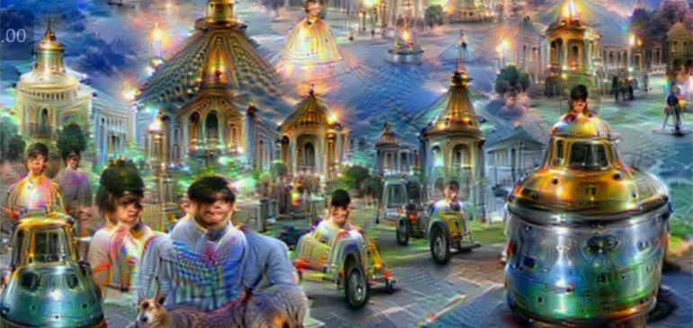
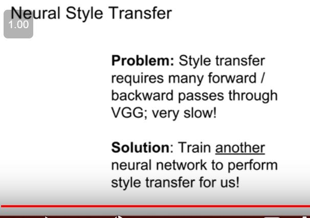

We can get some since for what these filters are looking for by simply visualizing the learned weights of these filters as images themselves. So, for each of those 11 by 11 by 3 filters in AlexNet, we can just visualize that filter as a little 11 by 11 image with a three channels give you the red, green and blue values. And then because there are 64 of these filters we just visualize 64 little 11 by 11 images. And we can repeat... So we have shown here at the. 

Why does visualizing the weights of the filters? Tell you what the filter is looking for. So this intuition comes from sort of template matching and inner products. That if you imagine you have some, some template vector. And then you imagine you compute a scaler output by taking inner product between your template vector and some arbitrary piece of data. Then, the input which maximizes that activation. Under a norm constraint on the input is exactly when those two vectors match up. So, in that since that, when, whenever you're taking inner products, the thing causes an inner product to excite maximally is a copy of the thing you are taking an inner product with. So, that, that's why we can actually visualize these weights and that, why that shows us, what this first layer is looking for. So, for these networks the first layers always was a convolutional layer. So, generally whenever you are looking at image. Whenever you are thinking about image data and training convolutional networks, you generally put a convolutional layer at the first, at the first stop. 

Though we are printing but as the weights in the intermediate layers does not have any connection to the input layer it kinda doesn't make any sense to us , so we need to develop some fancy technique to visualize.

Now at the last layer remember when we looking at the last layer of convolutional network. We have these maybe 1000 class scores that are telling us what are the predicted scores for each of the classes in our training data set and immediately before the last layer we often have some fully connected layer. In the case of Alex net we have some 4096- dimensional features representation of our image that then gets fed into that final our final layer to predict our final class scores. And one another, another kind of route for tackling the problem of visual, visualizing and understanding ConvNets is to try to understand what's happening at the last layer of a convolutional network. So what we can do is how to take some, some data set of images run a bunch of, run a bunch of images through our trained convolutional network and recorded that 4096 dimensional vector for each of those images. And now go through and try to figure out and visualize that last layer, that last hidden layer rather than those rather than the first convolutional layer. 

So, one thing you might imagine is, is trying a nearest neighbor approach. So, remember, way back in the second lecture we saw this graphic on the left where we, where we had a nearest neighbor classifier. Where we were looking at nearest neighbors in pixels space between CIFAR 10 images. And then when you look at nearest neighbors in pixel space between CIFAR 10 images you see that you pull up images that looks quite similar to the query image. So again on the left column here is some CIFAR 10 image from the CIFAR 10 data set and then these, these next five columns are showing the nearest neighbors in pixel space to those test set images. And so for example this white dog that you see here, it's nearest neighbors are in pixel space are these kinds of white blobby things that may, may or may not be dogs, but at least the raw pixels of the image are quite similar. So now we can do the same type of visualization computing and visualizing these nearest neighbor images. But rather than computing the nearest neighbors in pixel space, instead we can compute nearest neighbors in that 4096 dimensional feature space. Which is computed by the convolutional network. So here on the right we see some examples. So this, this first column shows us some examples of images from the test set of image that... Of the image net classification data set and now the, these subsequent columns show us nearest neighbors to those test set images in the 4096, in the 4096th dimensional features space computed by Alex net. And you can see here that this is quite different from the pixel space nearest neighbors, because the pixels are often quite different. between the image in it's nearest neighbors and feature space. However, the semantic content of those images tends to be similar in this feature space. So for example, if you look at this second layer the query image is this elephant standing on the left side of the image with a screen grass behind him. and now one of these, one of these... it's third nearest neighbor in the tough set is actually an elephant standing on the right side of the image. So this is really interesting. Because between this elephant standing on the left and this element stand, elephant standing on the right the pixels between those two images are almost entirely different. However, in the feature space which is learned by the network those two images and that being very close to each other. Which means that somehow this, this last their features is capturing some of those semantic content of these images. That's really cool and really exciting and, and in general looking at these kind of nearest neighbor visualizations is really quick and easy way to visualize something about what's going on here.

The question is, what is the nearest... What is this nearest neighbor thing have to do at the last layer? So we're taking this image we're running it through the network and then the, the second to last like the last hidden layer of the network is of 4096th dimensional vector. Because there's this, this is... This is there, there are these fully connected layers at the end of the network. So we are doing is... We're writing down that 4096th dimensional vector for each of the images and then we are computing nearest neighbors according to that 4096th dimensional vector. Which is computed by, computed by the network. 

Standing for t-distributed stochastic neighbor embeddings. Which is slightly more powerful method. Which is a non-linear dimensionality reduction method that people in deep often use for visualizing features. 

t-sne visualization on the right of them image 

This visualization here is, is showing a t-SNE dimensionality reduction on the emnest data set. So, emnest remember is this date set of hand written digits between zero and nine. Each image is a gray scale image 20... 28 by 28 gray scale image and now we're... So that Now we've, we've used t-SNE to take that 28 times 28 dimensional features space of the raw pixels for m-nest and now compress it down to two- dimensions ans then visualize each of those m-nest digits in this compress two-dimensional representation and when you do, when you run t-SNE on the raw pixels and m-nest 
You can see these natural clusters appearing. Which corresponds to the, the digits of these m-nest of, of these m-nest data set. 

we, we have an image so now we end up with three different pieces of information about each image. We have the pixels of the image. We have the 4096th dimensional vector. Then we use t-SNE to convert the 4096th dimensional vector into a two-dimensional coordinate and then we take the original pixels of the image and place that at the two-dimensional coordinate corresponding to the dimensionality reduced version of the 4096th dimensional feature. 

Visualizing activation will help

So another, another kind of useful thing we can do for visualizing intermediate features is... Visualizing what types of patches from input images cause maximal activation in different, different features, different neurons. So what we've done here is that, we pick... Maybe again the con five layer from Alex Net? And remember each of these activation volumes at the con, at the con five in Alex net gives us a 128 by 13 by 13 chunk of numbers. Then we'll pick one of those 128 channels. Maybe channel 17 and now what we'll do is run many images through this convolutional network. And then, for each of those images record the con five features and then look at the... Right, so, then, then look at the, the... The parts of that 17th feature map that are maximally activated over our data set of images. And now, because again this is a convolutional layer each of those neurons in the convolutional layer has some small receptive field in the input. Each of those neurons is not looking at the whole image. They're only looking at the sub set of the image. Then what we'll do is, is visualize the patches from the, from this large data set of images corresponding to the maximal activations of that, of that feature, of that particular feature in that particular layer. And then we can sorts these out, sort these patches by their activation at that, at that particular layer.

And now at the bottom we also see some maximally activating patches for neurons from a higher up layer in the same network. And now because they are coming from higher in the network they have a larger receptive field. So, they're looking at larger patches of the input image and we can also see that they're looking for maybe larger structures in the input image. So this, this second row is maybe looking, it seems to be looking for human, humans or maybe human faces. We have maybe something looking for... Parts of cameras or different types of larger, larger, larger object like type things, types of things.

 

is this idea of an exclusion experiment. So, what we want to do is figure out which parts of the input, of the input image cause the network to make it's classification decision. So, what we'll do is, we'll take our input image in this case an elephant and then we'll block out some part of that, some region in that input image and just replace it with the mean pixel value from the data set. And now, run that occluded image throughout, through the network and then record what is the predicted probability of this occluded image? And now slide this occluded patch over every position in the input image and then repeat the same process. And then draw this heat map showing, what was the predicted probability output from the network as a function of where did, which part of the input image did we occlude? And the idea is that if when we block out some part of the image if that causes the network score to change drastically. Then probably that part of the input image was really important for the classification decision. 

So, maybe this example of a Go-kart at the bottom, you can see over here that when we, so here, red, the, the red corresponds to a low probability and the white and yellow corresponds to a high probability. So when we block out the region of the image corresponding to this Go-kart in front. Then the predicted probability for the Go-kart class drops a lot. So that gives us some sense that the network is actually caring a lot about these, these pixels in the input image in order to make it's classification decision. 

So again, we have the same question of given an input image of a dog in this case and the predicted class label of dog we want to know which pixels in the input image are important for classification. 

And this will directly tell us in this sort of, first order approximation sense. For each input, for each pixel in the input image if we wiggle that pixel a little bit then how much will the classification score for the class change? And this is another way to get at this question of which pixels in the input matter for the classification. And when we, and when we run for example Saliency, where computer Saliency map for this dog, we see kind of a nice outline of a dog in the image. Which tells us that these are probably the pixels of that, network is actually looking at, for this image.

But, one kind of interesting thing about guided back propagation or computing saliency maps. Is that there's always a function of fixed input image, right, they're telling us for a fixed input image, which pixel or which parts of that input image influence the value of the neuron. Another question you might answer is is remove this reliance, on that, on some input image. And then instead just ask what type of input in general would cause this neuron to activate and we can answer this question using a technical Gradient ascent so, remember we always use Gradient decent to train our convolutional networks by minimizing the loss. 

Instead now, we want to fix the, fix the weight of our trained convolutional network and instead synthesizing image by performing Gradient ascent on the pixels of the image to try and maximize the score of some intermediate neuron or of some class. So, in a process of Gradient ascent, we're no longer optimizing over the weights of the network those weights remained fixed instead we're trying to change pixels of some input image to cause this neuron, or this neuron value, or this class score to maximally, to be maximized but, instead but, in addition we need some regularization term so, remember we always a, we before seeing regularization terms to try to prevent the network weights from over fitting to the training data. Now, we need something kind of similar to prevent the pixels of our generated image from over fitting to the peculiarities of that particular network. 

So, here we'll often incorporate some regularization term that, we're kind of, we want a generated image of two properties one, we wanted to maximally activate some, some score or some neuron value. But, we also wanted to look like a natural image. we wanted to kind of have, the kind of statistics that we typically see in natural images. So, these regularization term in the subjective is something to enforce a generated image to look relatively natural. 

But, what we'll do is start with some initial image either initializing to zeros or to uniform or noise. But, initialize your image in some way and I'll repeat where you forward your image through 3D network and compute the score or, or neuron value that you're interested. Now, back propagate to compute the Gradient of that neuron score with respect to the pixels of the image and then make a small Gradient ascent or Gradient ascent update to the pixels of the images itself. To try and maximize that score. And I'll repeat this process over and over again, until you have a beautiful image. 

And, then we talked, we talked about the image regularizer, well a very simple, a very simple idea for image regularizer is simply to penalize L2 norm of a generated image This is not so semantically meaningful, it's just does something, and this was one of the, one of the earliest regularizer that we've seen in the literature for these type of generating images type of papers. 

- And, when you run this on a trained network you can see that now we're trying to generate images that maximize the dumble score in the upper left hand corner here for example. And, then you can see that the synthesized image, it been, it's little bit hard to see may be but there're allot of different dumble like shapes, all kind of super impose that different portions of the image. or if we try to generate an image for cups then we can may be see a bunch of different cups all kind of super imposed the Dalmatian is pretty cool, because now we can see kind of this black and white spotted pattern that's kind of characteristics of Dalmatians or for lemons we can see these different kinds of yellow splotches in the image. And there's a couple of more examples here, I think may be the goose is kind of cool or the kitfox are actually may be looks like kitfox. 

- The question is, why are these all rainbow colored and in general getting true colors out of this visualization is pretty tricky. Right, because any, any actual image will be bounded in the range zero to 255. So, it really should be some kind of constrained optimization problem But, if, for using this generic methods for Gradient ascent then we, that's going to be unconstrained problem. So, you may be use like projector Gradient ascent algorithm or your rescaled image at the end. So, the colors that you see in this visualizations, sometimes are you cannot take them too seriously. 

- The question is what happens, if you let the thing loose and don't put any regularizer on it. Well, then you tend to get an image which maximize the score which is confidently classified as the class you wanted but, usually it doesn't look like anything. It kind of look likes random noise. So, that's kind of an interesting property in itself that will go into much more detail in a future lecture. But, that's why, that kind of doesn't help you so much for understanding what things the network is looking for. So, if we want to understand, why the network thing makes its decisions then it's kind of useful to put regularizer on there to generate an image to look more natural. 

- so then the angle here is a kind of to improve the regularizer to improve our visualized images. 

- So, you can see this is kind of a projector Gradient ascent algorithm where it reach periodically we're projecting our generated image onto some nicer set of images with some nicer properties. For example, special smoothness with respect to the gauchian blurring 

- Explaining multi-modality

So, this was a cool paper kind of explicitly trying to address this multi modality, there's someone asked question about a few minutes ago. So, here they were trying to explicitly take a count, take this multi modality into account in the optimization procedure where they did indeed, I think see the initial, so they for each of the classes, you run a clustering algorithm to try to separate the classes into different modes and then initialize with something that is close to one of those modes. And, then when you do that, you kind of account for this multi modality. so for intuition, on the right here these eight images are all of grocery stores. But, the top row, is kind of close up pictures of produce on the shelf and those are labeled as grocery stores And the bottom row kind of shows people walking around grocery stores or at the checkout line or something like that. And, those are also labeled those as grocery store, but their visual appearance is quiet different. So, a lot of these classes and that being sort multi modal And, if you can take, and if you explicitly take this more time mortality into account when generating images, then you can get nicer results. 

And, another really cool thing we can do with this, is this concept of fooling image So, what we can do is pick some arbitrary image, and then try to maximize the, so, say we take it picture of an elephant and then we tell the network that we want to, change the image to maximize the score of Koala bear instead So, then what we were doing is trying to change that image of an elephant to try and instead cause the network to classify as a Koala bear. And, what you might hope for is that, maybe that elephant was sort of thought more thing into a Koala bear and maybe he would sprout little cute ears or something like that. But, that's not what happens in practice, which is pretty surprising. Instead if you take this picture of a elephant and tell them that, tell them that and try to change the elephant image to instead cause it to be classified as a koala bear What you'll find is that, you is that this second image on the right actually is classified as koala bear but it looks the same to us. So that's pretty fishy and pretty surprising. So also on the bottom we've taken this picture of a boat. Schooner is the image in that class and then we told the network to classified as an iPod. So now the second example looks just, still looks like a boat to us but the network thinks it's an iPod and the difference is in pixels between these two images are basically nothing. And if you magnify those differences you don't really see any iPod or Koala like features on these differences, they're just kind of like random patterns of noise. So the question is what's going here? 

Yeah, the question is what is have in the... understanding this intermediate neurons how does that help our understanding of the final classification. So this is actually, this whole field of trying to visualize intermediates is kind of in response to a common criticism of deep learning. So a common criticism of deep learning is like, you've got this big black box network you trained it on gradient ascent, you get a good number and that's great but we don't trust the network because we don't understand as people why it's making the decisions, that's it's making. So a lot of these type of visualization techniques were developed to try and address that and try to understand as people why the network are making their various classification, classification decisions a bit more. Because if you contrast, if you contrast a deep convolutional neural network with other machine running techniques. Like linear models are much easier to interpret in general because you can look at the weights and kind of understand the interpretation between how much each input feature effect the decision or if you look at something like a random forest or decision tree. Some other machine learning models end up being a bit more interpretable just by their very nature then this sort of black box convolutional networks. So a lot of this is sort of in response to that criticism to say that, yes they are these large complex models but they are still doing some interesting and interpretable things under the hood. They are not just totally going out in randomly classifying things. They are doing something meaningful 

So this has the interpretation of trying to amplify existing features that were detected by the network in this image. Right? Because whatever features existed on that layer now we set the gradient equal to the feature and we just tell the network to amplify whatever features you already saw in that image. And by the way you can also see this as trying to maximize the L2 norm of the features at that layer of the image. And it turns... And when you do this the code ends up looking really simple. 

 So one trick is to jitter the image before you compute your gradients. So rather than running the exact image through the network instead you'll shift the image over by two pixels and kind of wrap the other two pixels over here. And this is a kind of regularizer to prevent each of these [mumbling] it regularizers a little bit to encourage a little bit of extra special smoothness in the image. 

 You also see they use L1 normalization of the gradients that's kind of a useful trick sometimes when doing this image generation problems. You also see them clipping the pixel values once in a while. So again we talked about images actually should be between zero to 255 so this is a kind of projected gradients decent where we project on to the space of actual valid images. But now when we do all this then we start, we might start with some image of a sky and then we get really cool results like this. 

Right, so these are kind of interesting, but actually this fact that dog show up so much in these visualization, actually does tell us something about the data on which this network was trained. Right, because this is a network that was trained for image net classification, image that have thousand categories. But 200 of those categories are dogs. So, so it's kind of not surprising in a sense that when you do these kind of visualizations then network ends up hallucinating a lot of dog like stuff in the image often morphed with other types of animals. 

When you do this other layers of the network you get other types of results. So here we're taking one of these lower layers in the network, the previous example was relatively high up in the network and now again we have this interpretation that lower layers maybe computing edges and swirls and stuff like that and that's kind of borne out when we running DeepDream at a lower layer. 

Or if you run this thing for a long time and maybe add in some multiscale processing you can get some really, really crazy images. 

Right, so here they're doing a kind of multiscale processing where they start with a small image run DeepDream on the small image then make it bigger and continue DeepDream on the larger image and kind of repeat with this multiscale processing and then you can get, and then maybe after you complete the final scale then you restart from the beginning and you just go wild on this thing. 

So these examples were all from networks trained on image net 

Deepdream trained on mit dataset which contains backgrounds like kitchen scene some scenery etc.

Code for deep dream is online.

So the question is, what are taking gradient of? So like I say, if you, because like one over x squared on the gradient of that is x. So, if you send back the volume of activation as the gradient, that's equivalent to max, that's equivalent to taking the gradient with respect to the like one over x squared some... Some of the values. So it's equivalent to maximizing the norm of that of the features of that layer. But in practice many implementation you'll see not explicitly compute that instead of send gradient back.

So another kind of useful, another kind of useful thing we can do is this concept of feature inversion. So this again gives us a sense for what types of, what types of elements of the image are captured at different layers of the network. So what we're going to do now is we're going to take an image, run that image through network record the feature value for one of those images and now we're going to try to reconstruct that image from its feature representation. And the question, and now based on the how much, how much like what that reconstructed image looks like that'll give us some sense for what type of information about the image was captured in that feature vector. So again, we can do this with gradient ascent with some regularizer. Where now rather than maximizing some score instead we want to minimize the distance between this catch feature vector. And between the computed features of our generated image. To try and again synthesize a new image that matches the feature back to that we computed before. And another kind of regularizer that you frequently see here is the total variation regularizer that you also see on your homework. So here with the total variation regularizer is panelizing differences between adjacent pixels on both of the left and adjacent in left and right and adjacent top to bottom. To again try to encourage special smoothness in the generated image. 

So, in 2015, there was a really cool paper that tried to apply neural network features to this problem of texture synthesis. And ended up framing it as kind of a gradient ascent procedure, kind of similar to the feature map, the various feature matching objectives that we've seen already. So, in order to perform neural texture synthesis they use this concept of a gram matrix. So, what we're going to do, is we're going to take our input texture and in this case some pictures of rocks and then take that input texture and pass it through some convolutional neural network and pull out convolutional features at some layer of the network. So, maybe then this convolutional feature volume that we've talked about, might be H by W by C or sorry, C by H by W at that layer of the network. So, you can think of this as an H by W spacial grid. And at each point of the grid, we have this C dimensional feature vector describing the rough appearance of that image at that point. And now, we're going to use this activation map to compute a descriptor of the texture of this input image. So, what we're going to do is take, pick out two of these different feature columns in the input volume. Each of these feature columns will be a C dimensional vector. And now take the outer product between those two vectors to give us a C by C matrix. This C by C matrix now tells us something about the co-occurrence of the different features at those two points in the image. Right, so, if an element, if like element IJ in the C by C matrix is large that means both elements I and J of those two input vectors were large and something like that. So, this somehow captures some second order statistics about which features, in that feature map tend to activate to together at different spacial volumes... At different spacial positions. And now we're going to repeat this procedure using all different pairs of feature vectors from all different points in this H by W grid. Average them all out, and that gives us our C by C gram matrix. And this is then used a descriptor to describe kind of the texture of that input image. So, what's interesting about this gram matrix is that it has now thrown away all spacial information that was in this feature volume. Because we've averaged over all pairs of feature vectors at every point in the image. Instead, it's just capturing the second order co-occurrence statistics between features. And this ends up being a nice descriptor for texture. And by the way, this is really efficient to compute. So, if you have a C by H by W three dimensional tensure you can just reshape it to see times H by W and take that times its own transpose and compute this all in one shot so it's super efficient. But you might be wondering why you don't use an actual covariance matrix or something like that instead of this funny gram matrix and the answer is that using covariance... Using true covariance matrices also works but it's a little bit more expensive to compute. So, in practice a lot of people just use this gram matrix descriptor. 

is that you'll take your style image and your content image pass them into your network to compute your gram matrices and your features. Now, you'll initialize your output image with some random noise. Go forward, compute your losses go backward, compute your gradients on the image and repeat this process over and over doing gradient ascent on the pixels of your generated image. And after a few hundred iterations, generally you'll get a beautiful image. 

Can also combine style transfer and deep dream