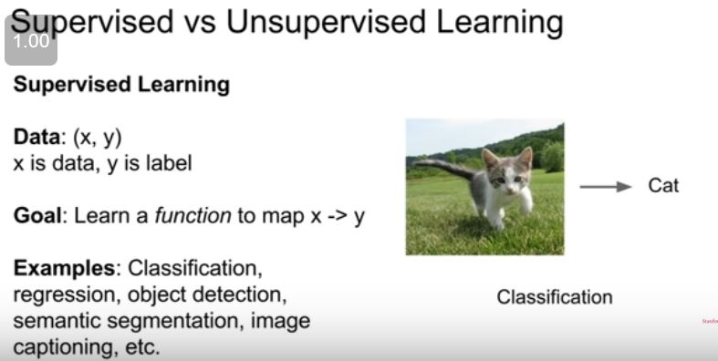

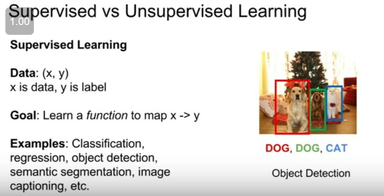

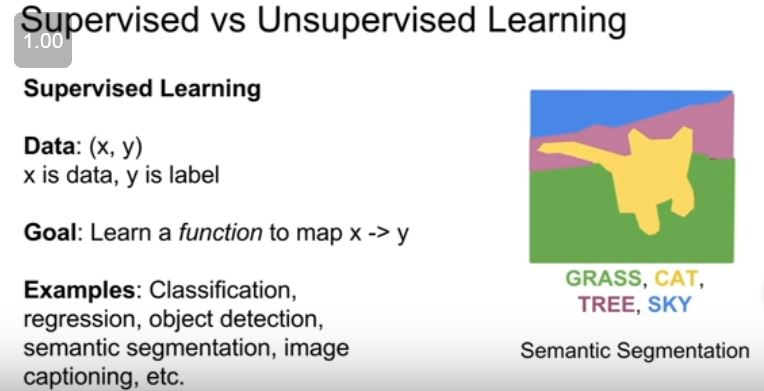

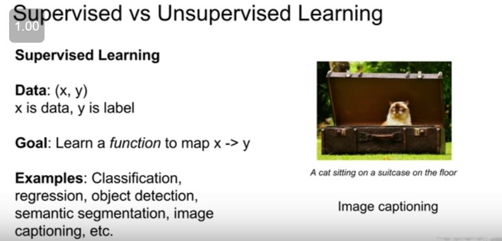

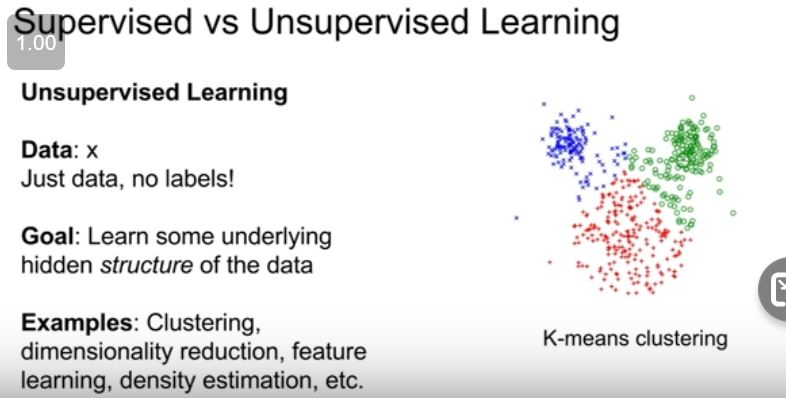 

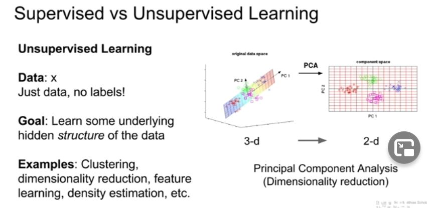 

 

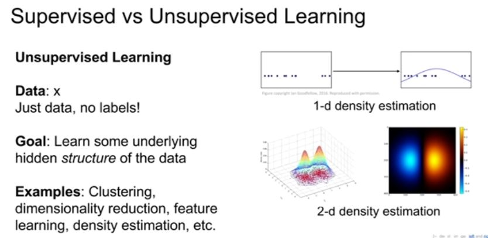 

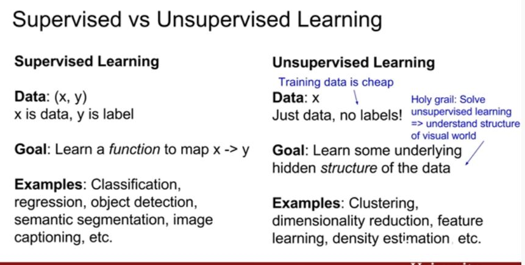 

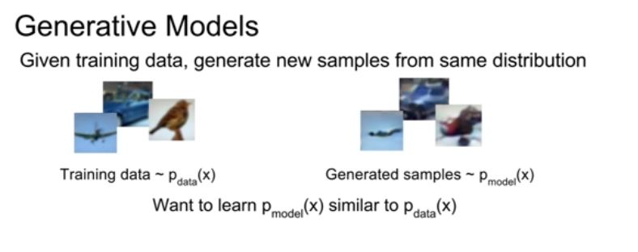

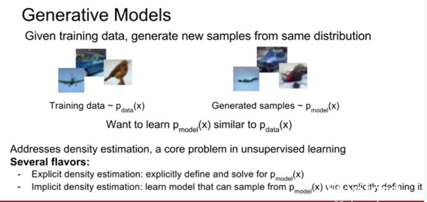

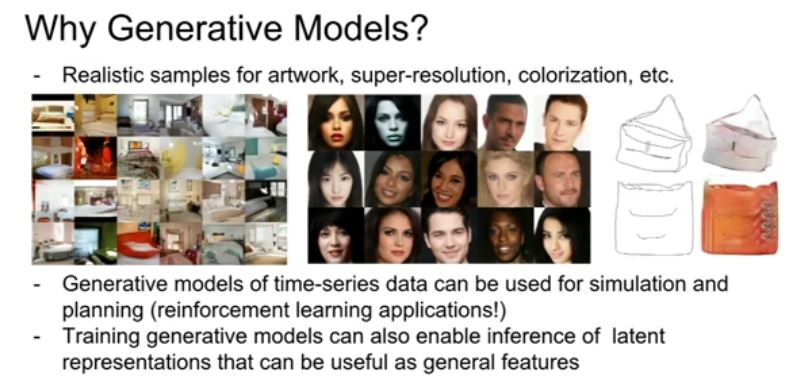

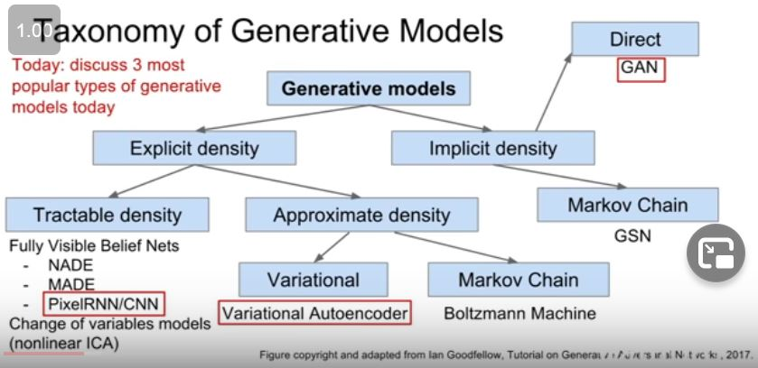

## PixleRNN and PixleCNN

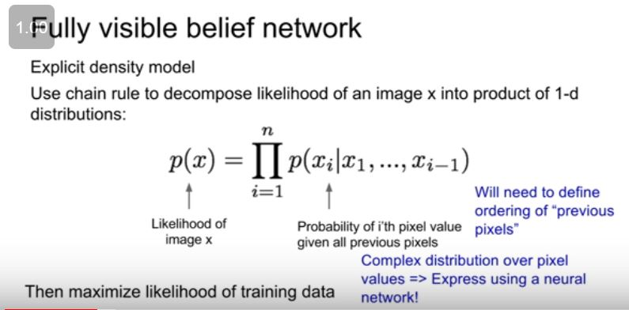

so in this case what they do is we have this image data X that we have and we want to model the probability or likelihood of this image P of X. Right and so in this case, for these kinds of models, we use the chain rule to decompose this likelihood into a product of one dimensional distribution. So we have here the probability of each pixel X I conditioned on all previous pixels X1 through XI - 1. and your likelihood all right, your joint likelihood of all the pixels in your image is going to be the product of all of these pixels together, all of these likelihoods together. And then once we define this likelihood, in order to train this model we can just maximize the likelihood of our training data under this defined density. 

So if we look at this this distribution over pixel values right, we have this P of XI given all the previous pixel values, well this is a really complex distribution. So how can we model this? Well we've seen before that if we want to have complex transformations we can do these using neural networks. Neural networks are a good way to express complex transformations. And so what we'll do is we'll use a neural network to express this complex function that we have of the distribution. And one thing you'll see here is that, okay even if we're going to use a neural network for this another thing we have to take care of is how do we order the pixels. Right, I said here that we have a distribution for P of XI given all previous pixels 

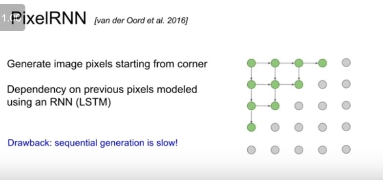

So PixelRNN was a model proposed in 2016 that basically defines a way for setting up and optimizing this problem and so how this model works is that we're going to generate pixels starting in a corner of the image. So we can look at this grid as basically the pixels of your image and so what we're going to do is start from the pixel in the upper left-hand corner and then we're going to sequentially generate pixels based on these connections from the arrows that you can see here. And each of the dependencies on the previous pixels in this ordering is going to be modeled using an RNN or more specifically an LSTM which we've seen before in lecture. Right so using this we can basically continue to move forward just moving down a long is diagonal and generating all of these pixel values dependent on the pixels that they're connected to. And so this works really well but the drawback here is that this sequential generation, right, so it's actually quite slow to do this. You can imagine you know if you're going to generate a new image instead of all of these feed forward networks that we see, we've seen with CNNs. Here we're going to have to iteratively go through and generate all these images, all these pixels. 

## PixelCNN

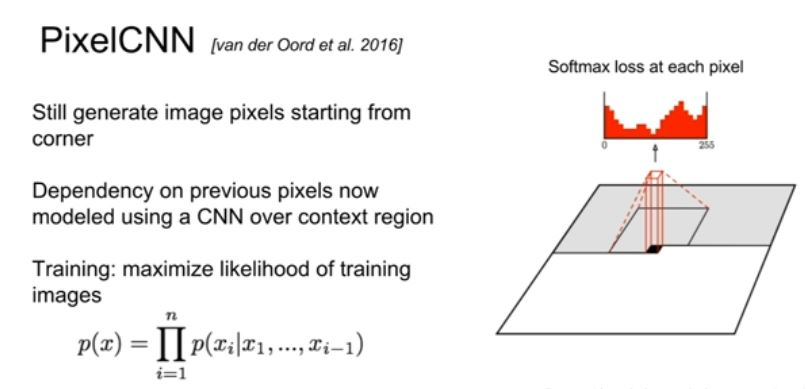

And this has very similar setup as pixelCNN and we're still going to do this image generation starting from the corner of the of the image and expanding outwards but the difference now is that now instead of using  an RNN to model all these dependencies we're going to use the CNN instead. And we're now going to use a CNN over a a context region that you can see here around in the particular pixel that we're going to generate now. Right so we take the pixels around it, this gray area within the region that's already been generated and then we can pass this through a CNN and use that to generate our next pixel value. And so what this is going to give is this is going to give This is a CNN, a neural network at each pixel location right and so the output of this is going to be a soft max loss over the pixel values here. In this case we have a 0 to 255 and then we can train this by maximizing the likelihood of the training images. Right so we say that basically we want to take a training image we're going to do this generation process and at each pixel location we have the ground truth training data image value that we have here and this is a quick basically the label or the the the classification label that we want our pixel to be which of these 255 values and we can train this using a Softmax loss. Right and so basically the effect of doing this is that we're going to maximize the likelihood of our training data pixels being generated. 

- Yeah, so the question is, I thought we were talking about unsupervised learning, why do we have basically a classification label here? The reason is that this loss, this output that we have is the value of the input training data. So we have no external labels, right? We didn't go and have to manually collect any labels for this, we're just taking our input data and saying that this is what we used for the last function. 

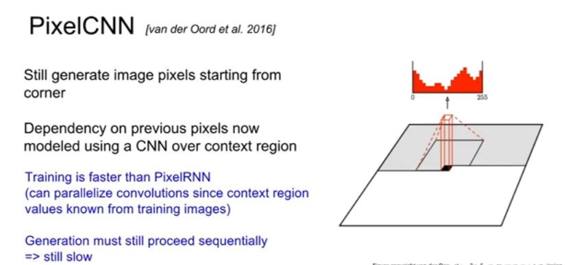

So using pixelCNN training is faster than pixelRNN because here now right at every pixel location we want to maximize the value of our, we want to maximize the likelihood of our training data showing up and so we have all of these values already right, just from our training data and so we can do this much faster but a generation time for a test time we want to generate a completely new image right, just starting from the corner and we're not, we're not trying to do any type of learning so in that generation time we still have to generate each of these pixel locations before we can generate the next location. And so generation time here it still slow even though training time is faster. 

So again, how do you pick this distribution? So at training time you have these distributions from your training data and then at generation time you can just initialize this with either uniform or from your training data, however you want. And then once you have that everything else is conditioned based on that. 

Pixle distribution depends on training data.

what the chain rule allows us to do is it allows us to find this very tractable density that we can then basically optimize and do, directly optimizes likelihood 

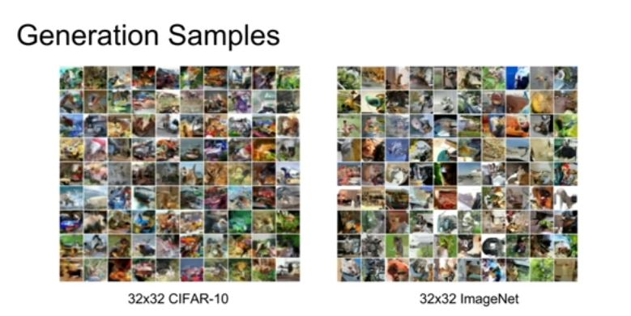

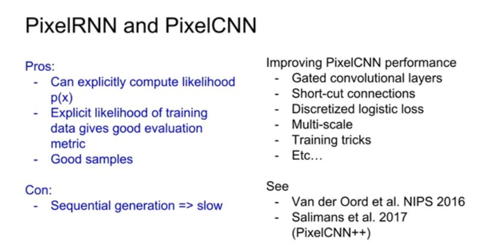

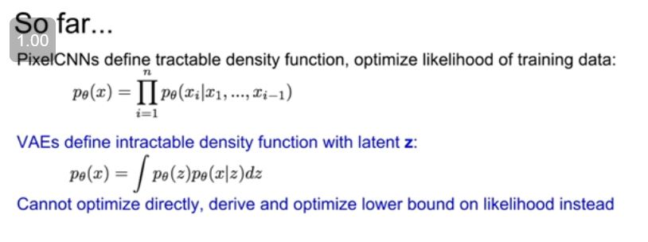

## Variational Autoencoders(VAE)

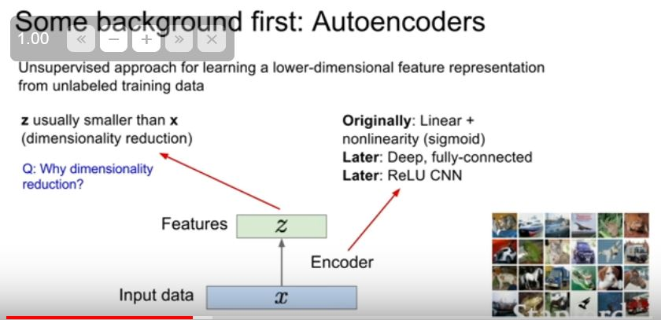

All right so in this case we have our input data X and then we're going to want to learn some features that we call Z. And then we'll have an encoder that's going to be a mapping, a function mapping from this input data to our feature Z. And this encoder can take many different forms right, they would generally use neural networks so originally these models have been around, autoencoders have been around for a long time. So in the 2000s we used linear layers of non-linearities, then later on we had fully connected deeper networks and then after that we moved on to using CNNs for these encoders. So we take our input data X and then we map this to some feature Z. And Z we usually have as, we usually specify this to be smaller than X and we perform basically dimensionality reduction because of that. 

So the question who has an idea of why do we want to do dimensionality reduction here? Why do we want Z to be smaller than X? 
Z should represent the most important features in X. So we want Z to be able to learn features that can capture meaningful factors of variation in the data.

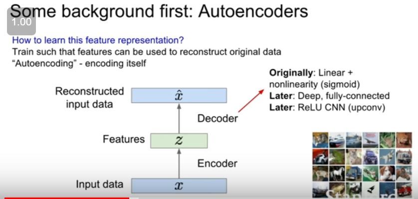

So what we want is we want to have input data that we use an encoder to map it to some lower dimensional features Z. This is the output of the encoder network, and we want to be able to take these features that were produced based on this input data and then use a decoder a second network and be able to output now something of the same size dimensionality as X and have it be similar to X right so we want to be able to reconstruct the original data. And again for the decoder we are basically using same types of networks as encoders so it's usually a little bit symmetric and now we can use CNN networks for most of these. 

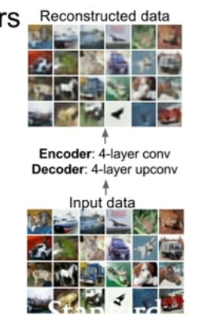

Right in the reason why we have a convolutional network for the encoder and an upconvolutional network for the decoder is because at the encoder we're basically taking it from this high dimensional input to these lower dimensional features and now we want to go the other way go from our low dimensional features back out to our high dimensional reconstructed input. 

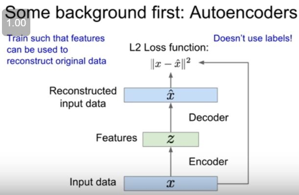

And so in order to get this effect that we said we wanted before of being able to reconstruct our input data we'll use something like an L2 loss function. Right that basically just says let me make my pixels of my input data to be the same as my, my pixels in my reconstructed data to be the same as the pixels of my input data. An important thing to notice here, this relates back to a question that we had earlier, is that even though we have this loss function here, there's no, there's no external labels that are being used in training this. All we have is our training data that we're going to use both to pass through the network as well as to compute our loss function. 

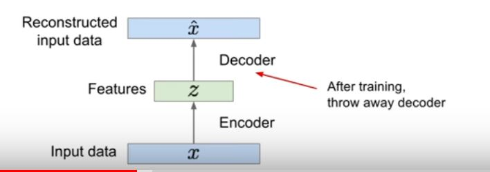

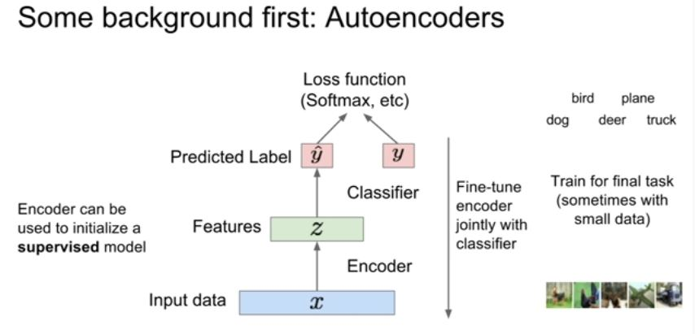

Right and so for example we can now go from this input to our features and then have an additional classifier network on top of this that now we can use to output a class label for example for classification problem we can have external labels from here and use our standard loss functions like Softmax. And so the value of this is that we basically were able to use a lot of unlabeled training data to try and learn good general feature representations. Right, and now we can use this to initialize a supervised learning problem where sometimes we don't have so much data we only have small data. 

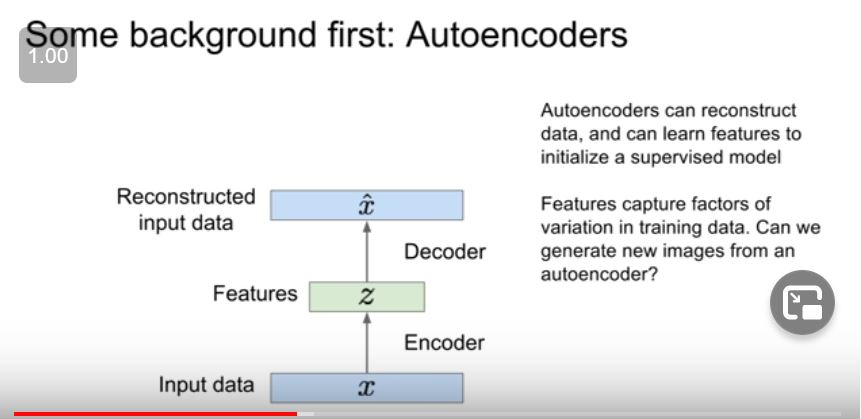

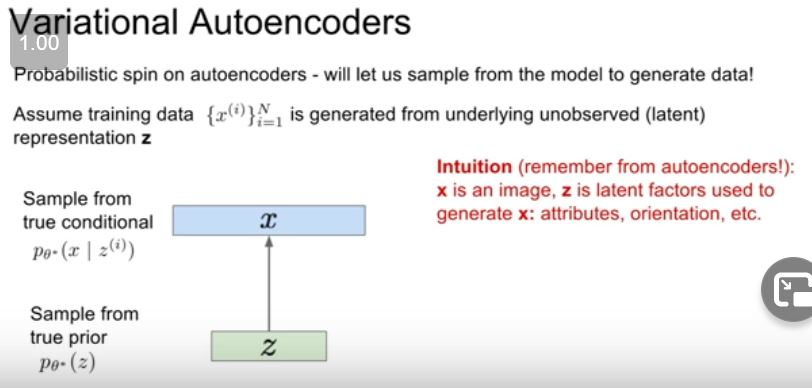

All right so here we assume that our training data that we have X I from one to N is generated from some underlying, unobserved latent representation Z. Right, so it's this intuition that Z is some vector right which element of Z is capturing how little or how much of some factor of variation that we have in our training data. Right so the intuition is, you know, maybe these could be something like different kinds of attributes. Let's say we're trying to generate faces, it could be how much of a smile is on the face, it could be position of the eyebrows hair orientation of the head. These are all possible types of latent factors that could be learned. Right, and so our generation process is that we're going to sample from a prior over Z. Right so for each of these attributes for example, you know, how much smile that there is, we can have a prior over what sort of distribution we think that there should be for this so, a gaussian is something that's a natural prior that we can use for each of these factors of Z and then we're going to generate our data X by sampling from a conditional, conditional distribution P of X given Z. So we sample Z first, we sample a value for each of these latent factors and then we'll use that and sample our image X from here. 

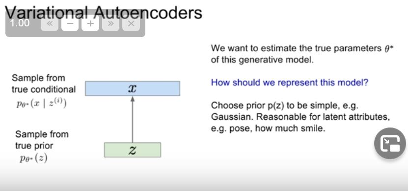

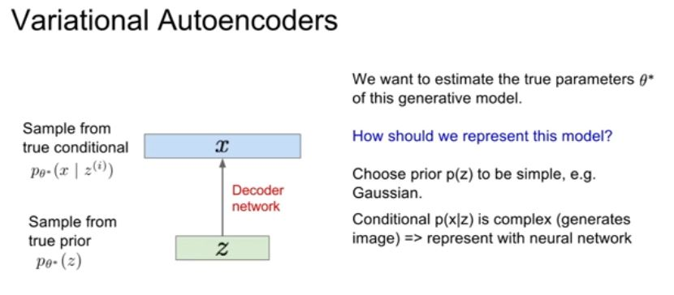

And we're going to call this the decoder network. Right, so we're going to think about taking some latent representation and trying to decode this into the image that it's specifying. 

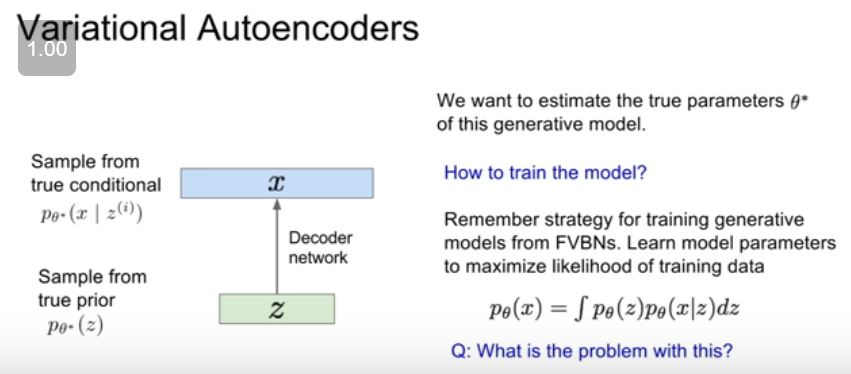

Right, so we saw earlier that in this case, with our latent variable Z, we're going to have to write out P of X taking expectation over all possible values of Z which is continuous and so we get this expression here. Right so now we have it with this latent Z and now if we're going to, if you want to try and maximize its likelihood, well what's the problem? Can we just take this take gradients and maximize this likelihood? 

so this integral is not going to be tractable,

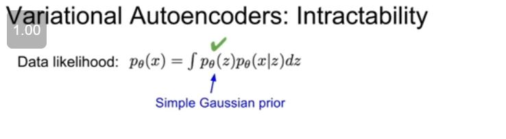

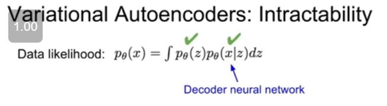

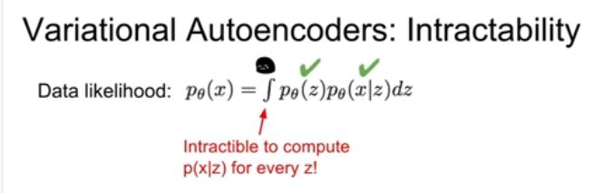

but what this is symbolizing is that basically if we want to compute P of X given Z for every Z this is now intractable right, we cannot compute this integral. So data likelihood is intractable 

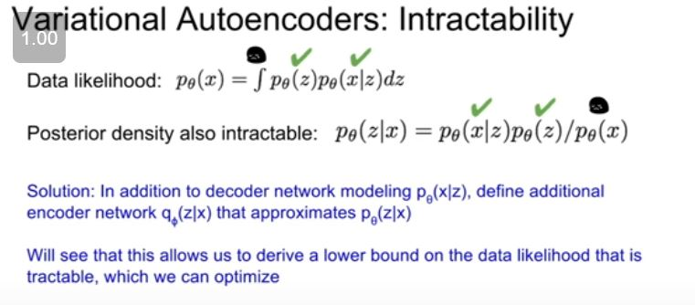

and it turns out that if we look at other terms in this model if we look at our posterior density, So P of our posterior of Z given X, then this is going to be P of X given Z times P of Z over P of X by Bayes' rule and this is also going to be intractable, right. We have P of X given Z is okay, P of Z is okay, but we have this P of X our likelihood which has the integral and it's intractable. 

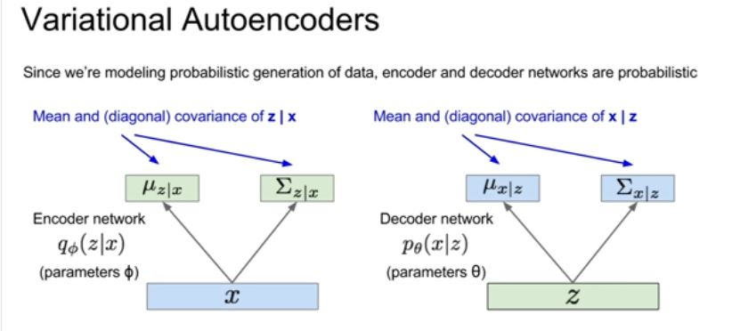

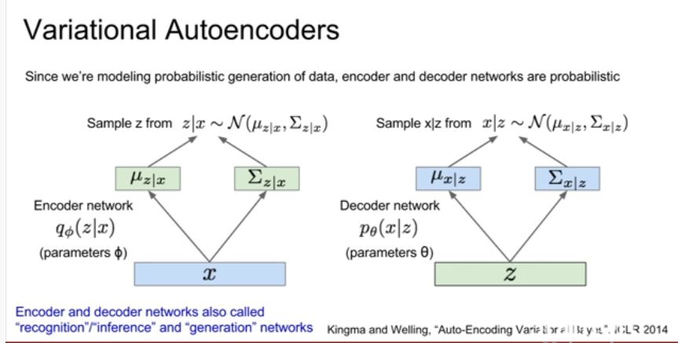

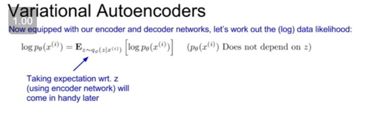

And we can do this because P of X doesn't depend on Z. 

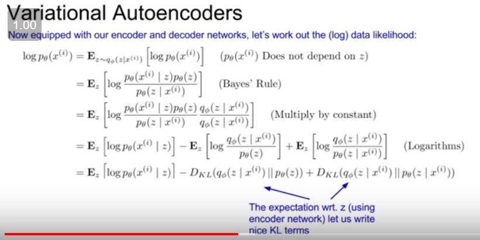

This is basically KL divergence term to say how close these two distributions are. So how close is a distribution Q of Z given X to P of Z. So it's just the, it's exactly this expectation term above. And it's just a distance metric for distributions. 

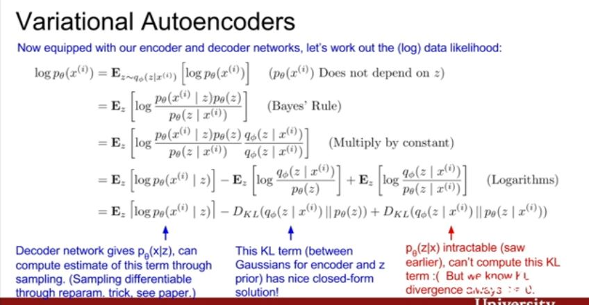

But one thing we do know about this term is that KL divergence, it's a distance between two distributions is always greater than or equal to zero by definition. 

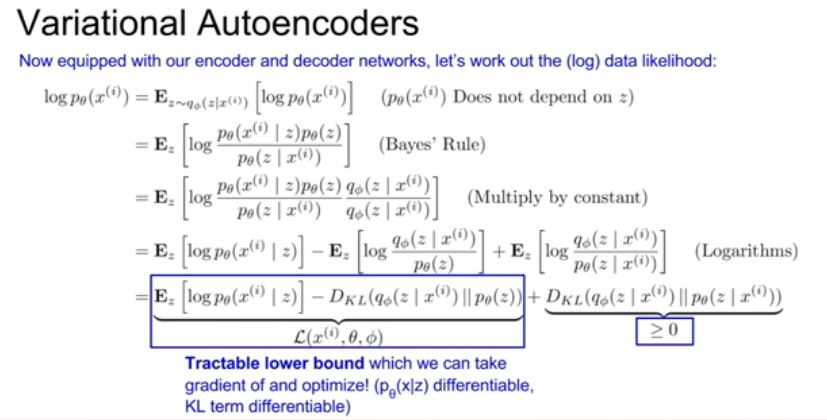

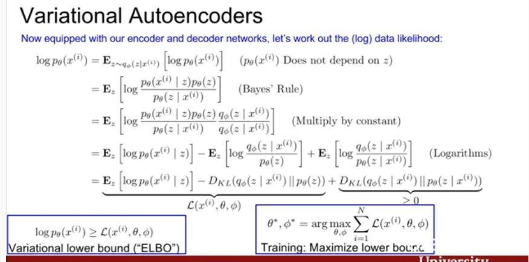

And so what we'll do to train a variational autoencoder is that we take this lower bound and we instead optimize and maximize this lower bound instead. So we're optimizing a lower bound on the likelihood of our data. So that means that our data is always going to have a likelihood that's at least as high as this lower bound that we're maximizing. And so we want to find the parameters theta, estimate parameters theta and phi that allows us to maximize this. 

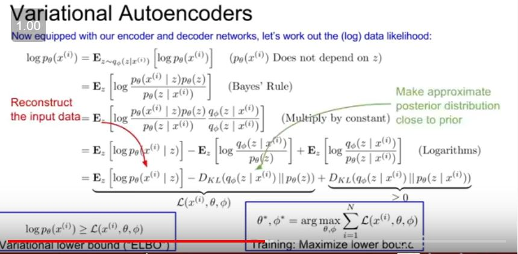

And then one last sort of intuition about this lower bound that we have is that this first term is expectation over all samples of Z sampled from passing our X through the encoder network sampling Z taking expectation over all of these samples of likelihood of X given Z and so this is a reconstruction, right? This is basically saying, if I want this to be big I want this likelihood P of X given Z to be high, so it's kind of like trying to do a good job reconstructing the data. So similar to what we had from our autoencoder before. But the second term here is saying make this KL small. Make our approximate posterior distribution close to our prior distribution. And this basically is saying that well we want our latent variable Z to be following this, have this distribution type, distribution shape that we would like it to have. 

So the question is why do we specify the prior and the latent variables as Gaussian? And the reason is that well we're defining some sort of generative process right, of sampling Z first and then sampling X first. And defining it as a Gaussian is a reasonable type of prior that we can say makes sense for these types of latent attributes to be distributed according to some sort of Gaussian, and then this lets us now then optimize our model. 

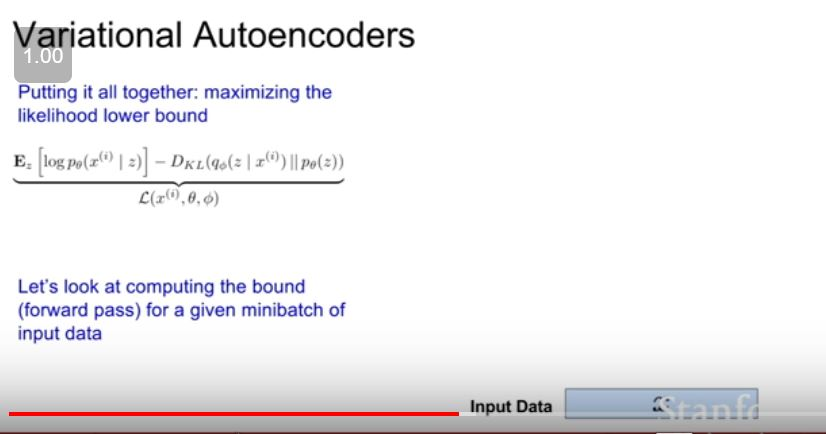

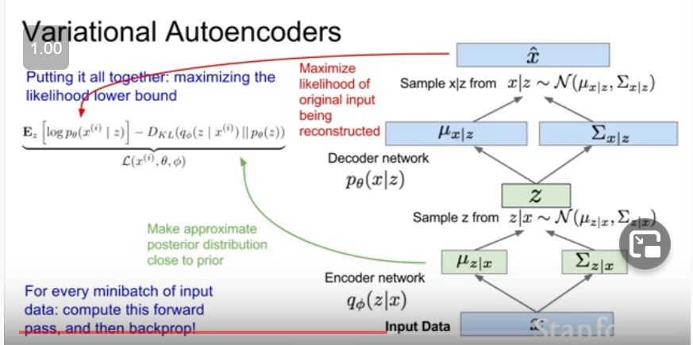

And when we're training we're going to take this distribution and say well our loss term is going to be log of our training image pixel values given Z. So our loss functions going to say let's maximize the likelihood of this original input being reconstructed. And so now for every mini batch of input we're going to compute this forward pass. Get all these terms that we need and then this is all differentiable so then we just backprop though all of this and then get our gradient, we update our model and we use this to continuously update our parameters, our generator and decoder network parameters theta and phi in order to maximize the likelihood of the trained data.

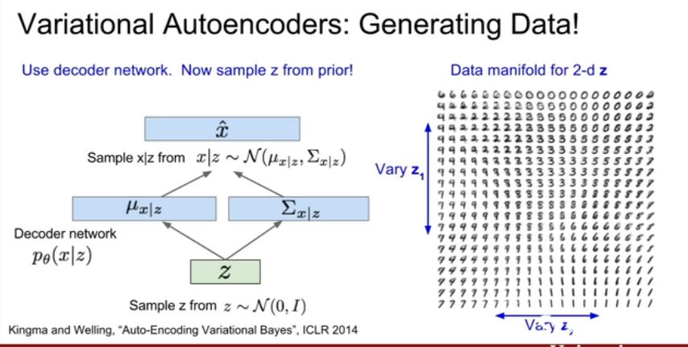

Okay so once we've trained our VAE, so now to generate data, what we can do is we can use just the decoder network. All right, so from here we can sample Z now, instead of sampling Z from this posterior that we had during training, while during generation we sample from our true generative process. So we sample from our prior that we specify. And then we're going to then sample our data X from here. And we'll see that this can produce, in this case, train on MNIST, these are samples of digits generated from a VAE trained on MNIST. And you can see that, you know, we talked about this idea of Z representing these latent factors where we can bury Z right according to our sample from different parts of our prior and then get different kind of interpretable meanings from here. So here we can see that this is the data manifold for two dimensional Z. So if we have a two dimensional Z and we take Z and let's say some range from you know, from different percentiles of the distribution, and we vary Z1 and we vary Z2, then you can see how the image generated from every combination of Z1 and Z2 that we have here, you can see it's transitioning smoothly across all of these different variations. 

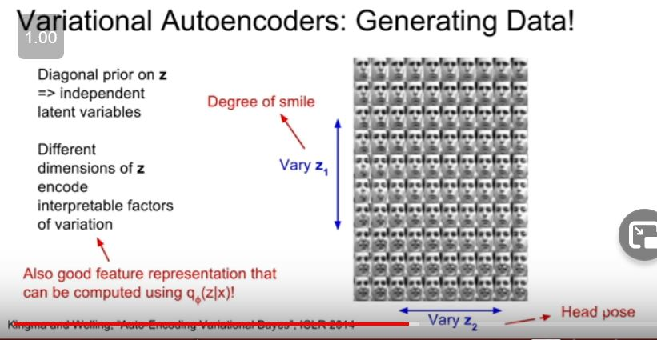

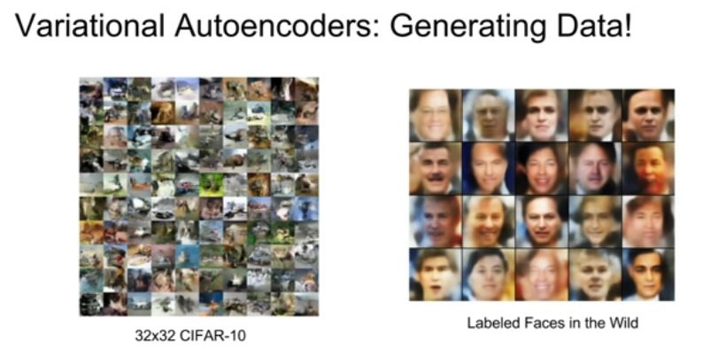

One of the main drawbacks of VAEs is that they tend to still have a bit of a blurry aspect to them. 

they're a probabilistic spin on traditional autoencoders. So instead of deterministically taking your input X and going to Z, feature Z and then back to reconstructing X, now we have this idea of distributions and sampling involved which allows us to generate data. And in order to train this, VAEs are defining an intractable density. So we can derive and optimize a lower bound, a variational lower bound, so variational means basically using approximations to handle these types of intractable expressions. And so this is why this is called a variational autoencoder. 

Yeah, so the question is we're deciding the dimensionality of the latent variable. Yeah, that's something that you specify. 

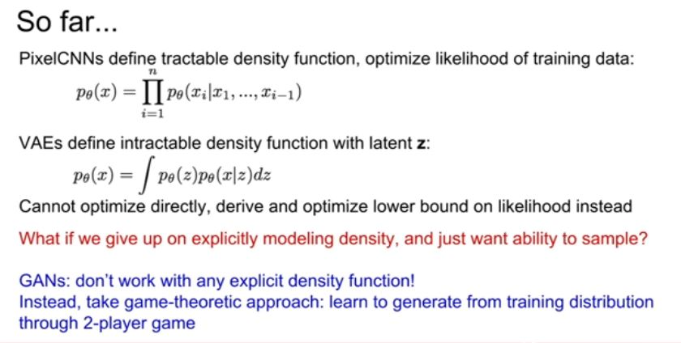

Neural network, I heard the answer. So when we want to model some kind of complex function or transformation we use a neural network. 

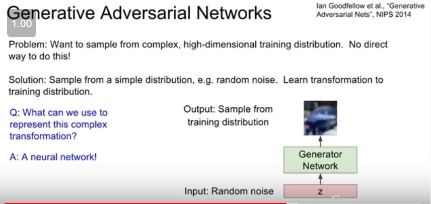

Okay so what we're going to do is we're going to take in the GAN set up, we're going to take some input which is a vector of some dimension that we specify of random noise and then we're going to pass this through a generator network, and then we're going to get as output directly a sample from the training distribution. So every input of random noise we want to correspond to a sample from the training distribution

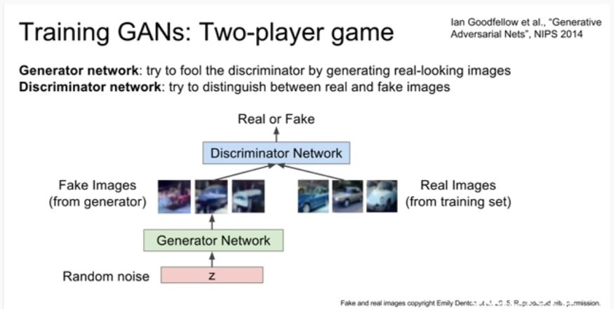

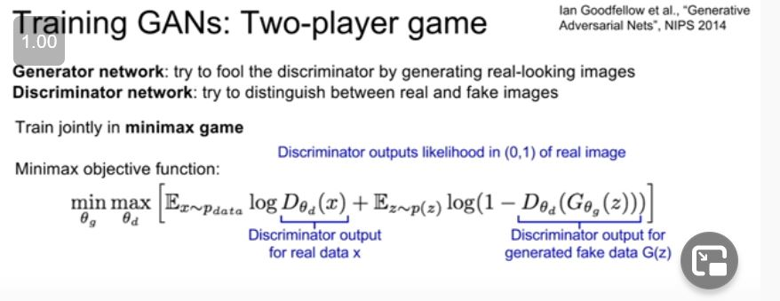

thetag -> generator parameter

thetad -> discriminator parameter.

Z drawn from P of Z means samples from our generator network and this term D of G of Z that we have here is the output of our discriminator .

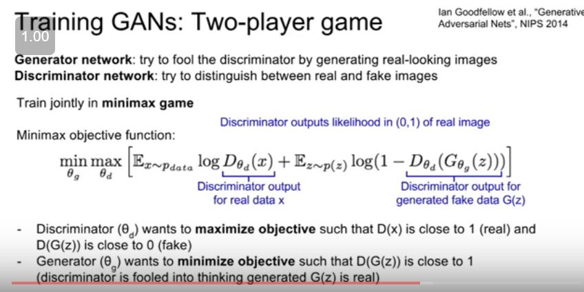

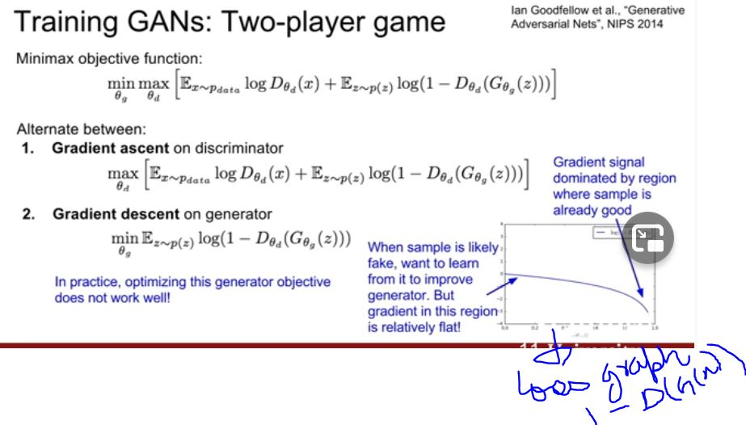

And so what this actually means is that our our gradient signal is dominated by region where the sample is already pretty good. Whereas we actually want it to learn a lot when the samples 

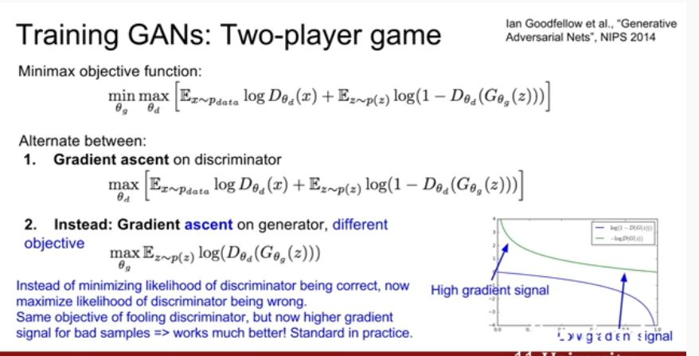

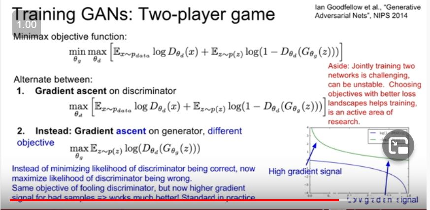

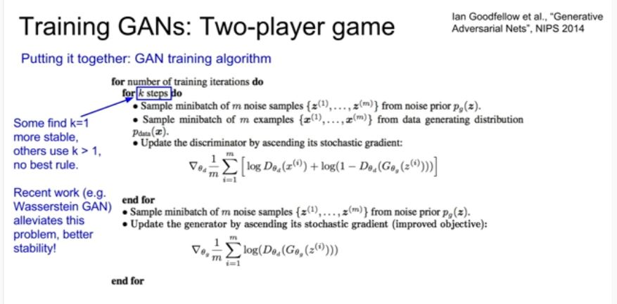

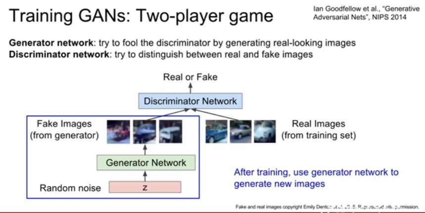

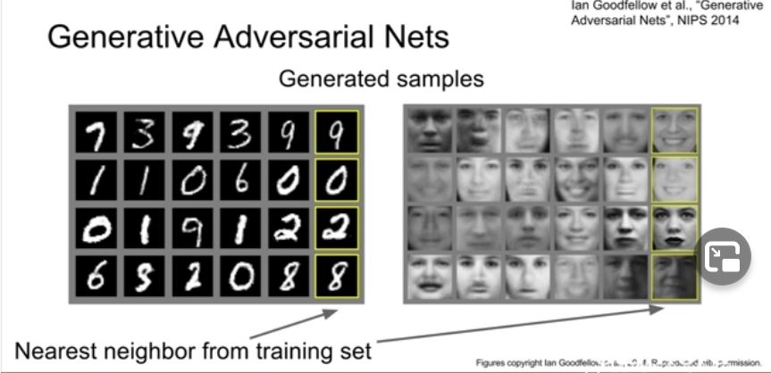

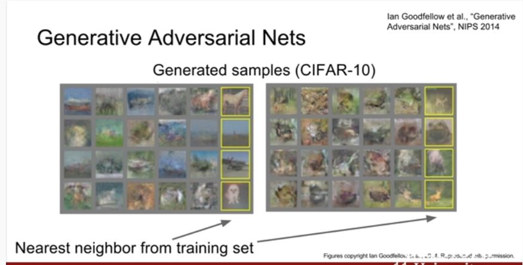

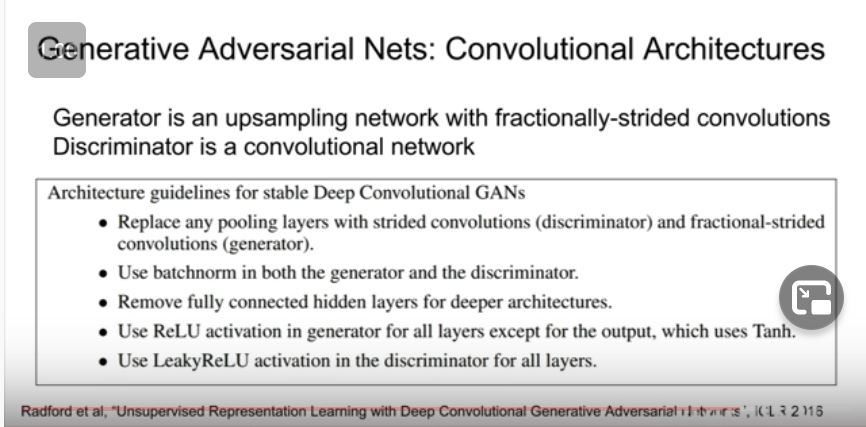

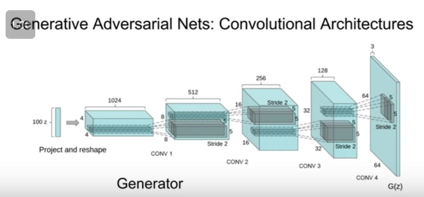

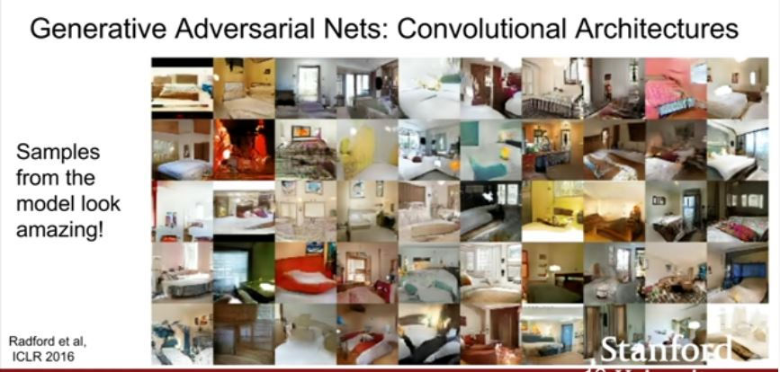

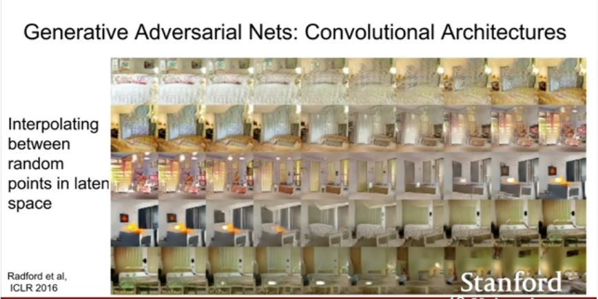

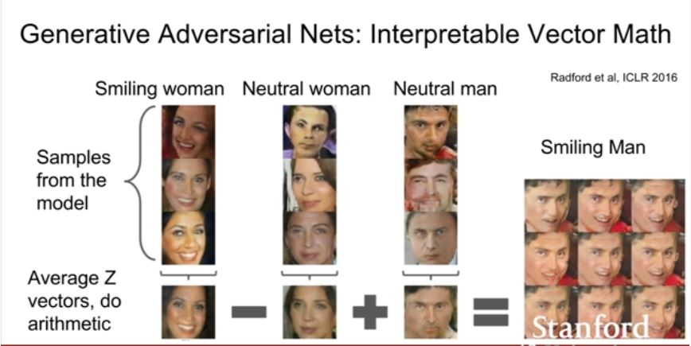

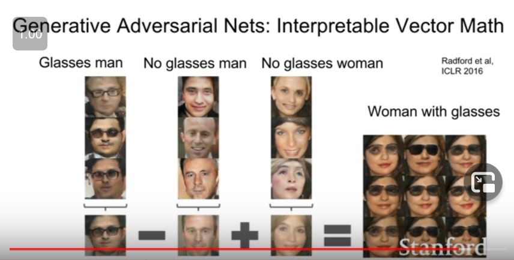

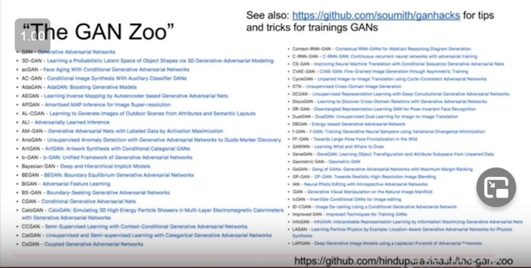

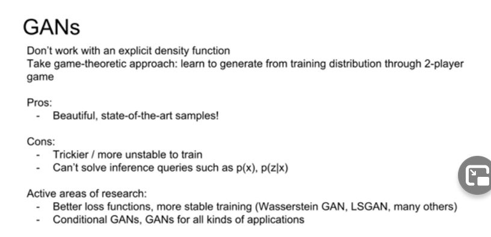

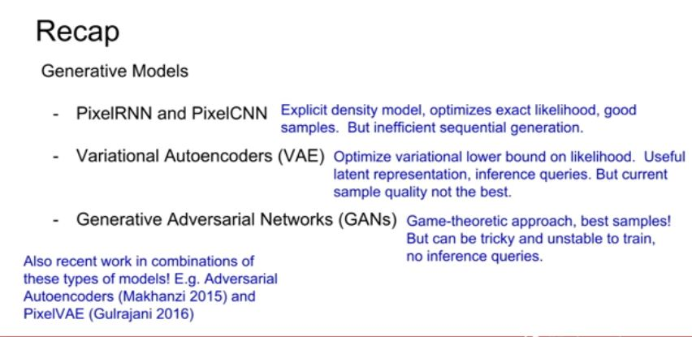