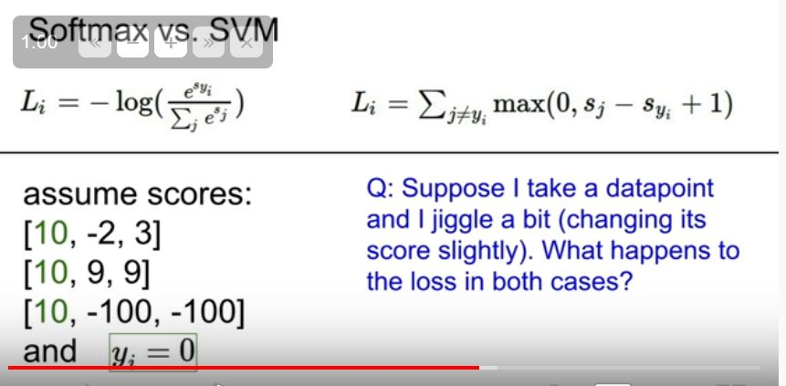

```
f(x,W) = Wx
```


Multiclass SVM is for multiple class there us something like binary class svm which is only for 2 class.


Here 1 is a safety margin it can be any value we generally take 1 here safety margin is set so that we can show that value of the true category is much much larger than the false category. 1 ia arbitary. We only care about the relative scores.


this style of taking loss were we always take max of 0 or something is called hinge loss.This name comes from the shape of the graph 

x axis is syi and y axis loss

Loss is saying that we are happy that true score is much higher than the other class scores.


- Min loss - 0
- Max loss - infinity


The answer to the question is number of (class - 1). This is a debugging strategy very useful.


Answer is loss increases by one . The answer won't change but its just by convention we do this.

If we use mean instead of sum nothing will change.


The problem will change here. Here the idea is are changing the trade of between good and bad in a non linear way so this would compute a different linear function. 
Squared loss says that we really hate loss.
Depends on application.


A trick here is to notice that we are putting 0 in the margin of the correct class. 


Regularization restricts the complexity of the model.How?

What is euclidian norm or norm?


How does the L2 regularization measure the complexity of the model?
- we have x and w1 and w2 
- x -> 1 1 1 1
- w1 -> 1 0 0 0
- w2 -> 0.25 0.25 0.25 0.25
- in linear classification we take dot product of x and w that is x.w
- So the question is which w will L2 prefer given that x.w1 = x.w2 = 1
- So L2 will prefer w2 because smaller norm.
- L2 is saying that it prefers to spread the weight
- L1 will choose w1 completely opposite than L2 


What to choose L1 or L2 depends on the problem.

- hypothesis - a + a0x + a1x^2 .........
- w = [a a0 a1..........]

## Softmax Classifier (Multinomial Logistic Regression)


- In SVM we kinda didn't give meaning to the scores obtained here in softmax we are giving meaning to the classes score by making it a probability distribution.

- The true values are 1 for the correct class and 0 for all other class. While giving scores in softmax we try to put the weigth on the correct class as much as possible that is we try correct class to be as close to 1 as possible and all other can be close to 0

- Then we take log because its easier to maximise the log function rather than a raw probability distribution as log is monotonically increasing function. And we atlast put a negative sign because in loss we measure how bad the hypothesis is not the other way round.

- So in short we try to increase the probability of the correct class and took log because its easy to maximise and put negative to measure how bad it did.

- So loss function is minus log to the probability of true class.


Min and Max value of Softmax loss
- Min - 0
- Max - infinity / unbounded
Probability can be 0 or 1

What would be the scores look like to take the loss 0?
So the scores have to be infinity for the correct class and negavity infinity for the wrong classes and as computers are not good with 0 we will never get 0 loss.

0 is theoritical min

Same goes for max

- If all the s are 0 or samll then what is the loss here?
    - (log(c))




Difference between svm and softmax?
- In svm we didnt care about the loss if the score of correct class is much greater than other classes and even if we change the correct class score it does not care. But softmax always tries to make the correct class score 1 so it matters if we change the value of correct classs loss changes.


1. we have score function
2. we have loss function
3. we have a regularization term
4. we find w

Now The question is how do we find w ?

This leads us to the topic optimization.

Bad Algorithm


Each gradient will tell us what would be the function shape if we move in that direction.

We can compute the gradient using the traditional derivative definition but this is very slow.


But we can use calculus to calculate this and this is a far better technique.


 --> a good debugging technique

 

gradient points to the greatest increase and - gradient points to the greatest decrease.

step size or learning rate is a hyper parameter.

 

 

Didn't understand SGD

In linear classification of image we feed raw pixles to the image and it doesn't make sense and is not a good idea. What was done prior to the neural network was that we take a picture than define features and compute feature representation and then feed those to the linear classifier. 


Linear classifier will not work in the left image so we convert to polar coordinates.


One common feature vector is the colored histogram where for each pixle in the image we put them into a colored histogram and pass it to the linear classifier


In the above picture we do it will take our image and divide it in the 8*8 pixles and we calculate a histogram for the dominant edges in the 8*8 picture.


