## Backpropagation and Neural Networks

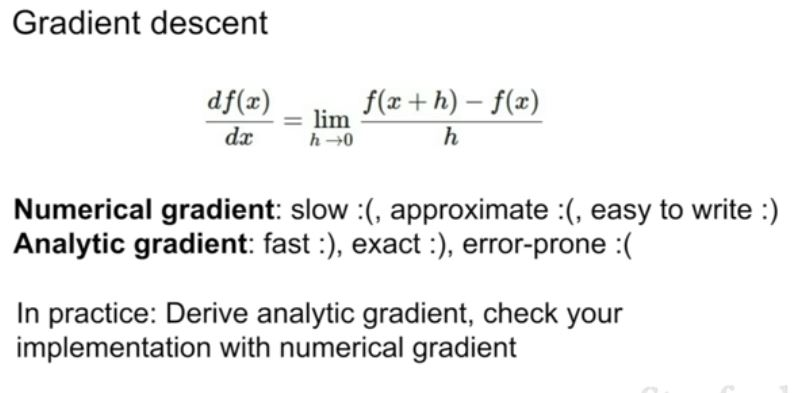

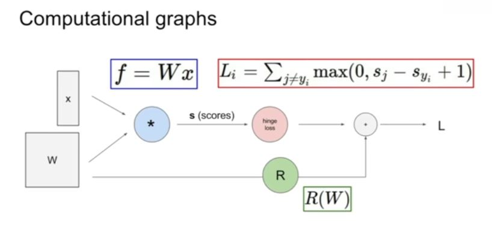

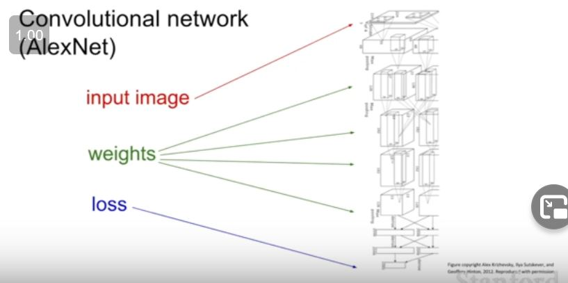

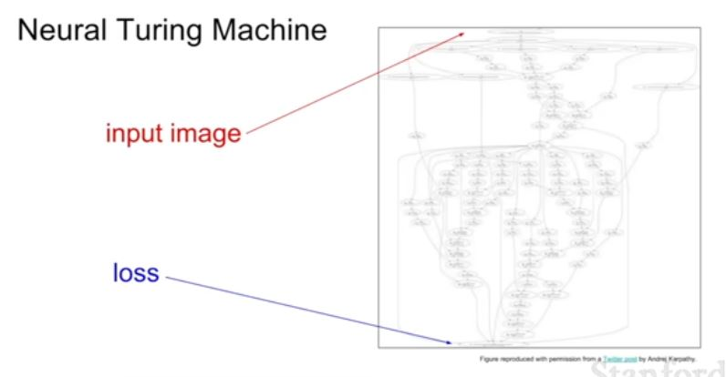

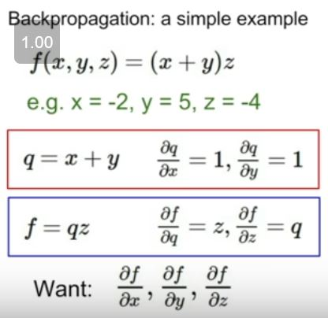

We need to find df/dx ,  df/dy , df/dz

We start from the back calculating df/df which is equal to 1 . Then move backwards like df/dz , df/dq , df/dx , df/dy

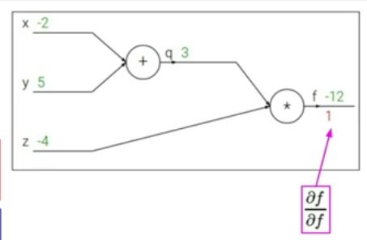

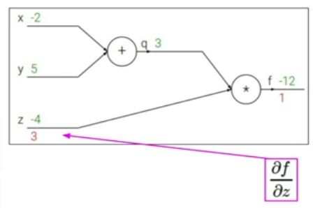

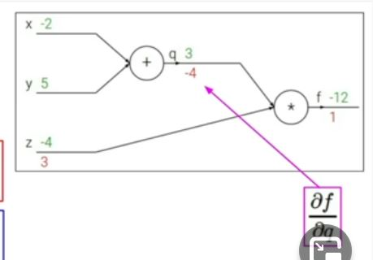

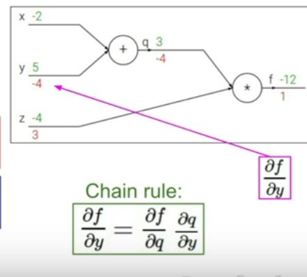

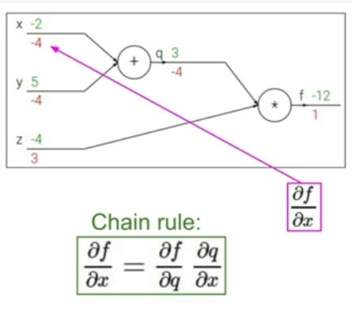

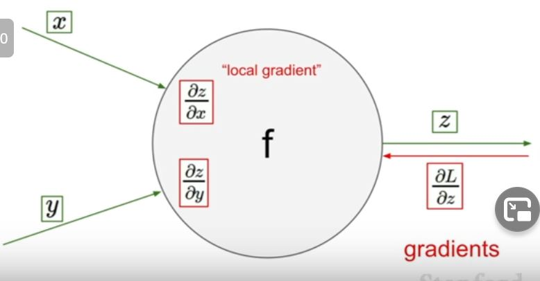

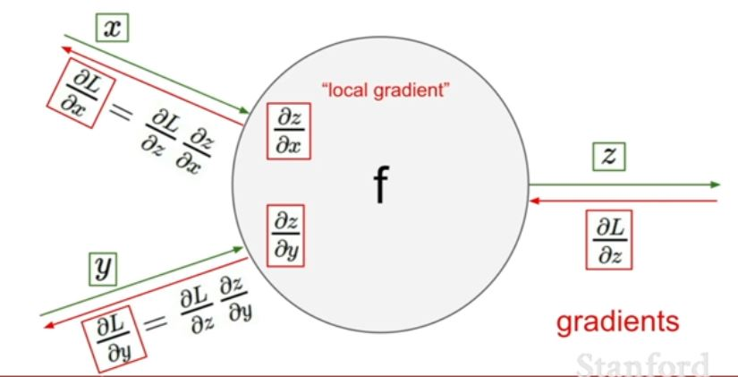

### BackPropagation step by step

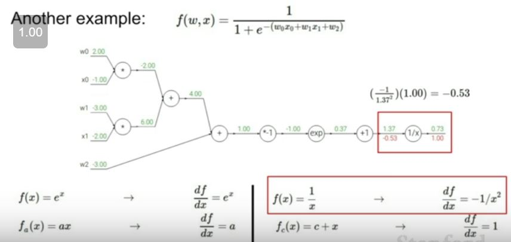

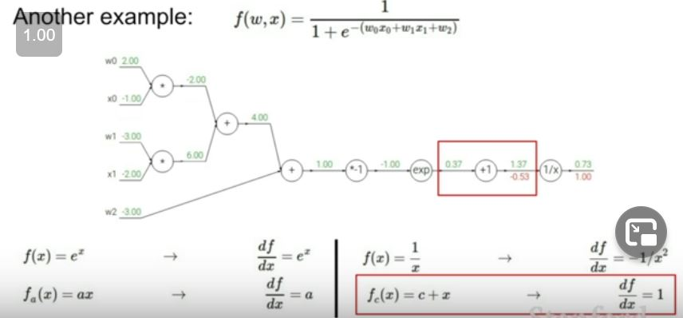

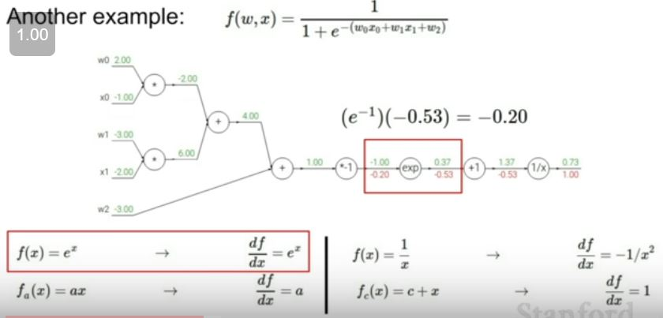

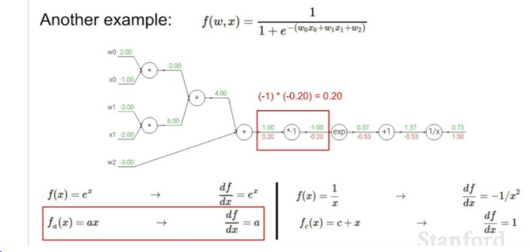

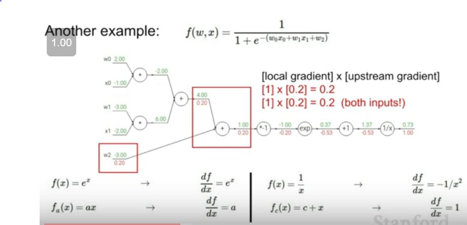

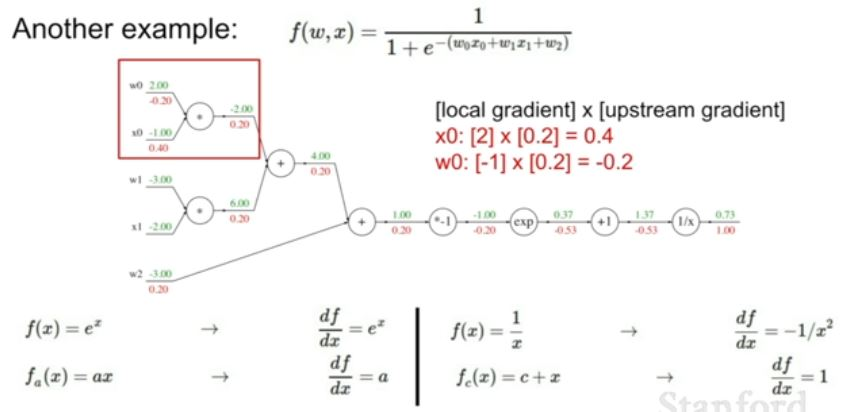

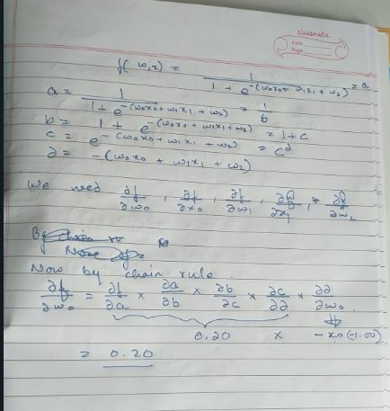

We can group together some compututional nodes to a more complex node. See the pic below.

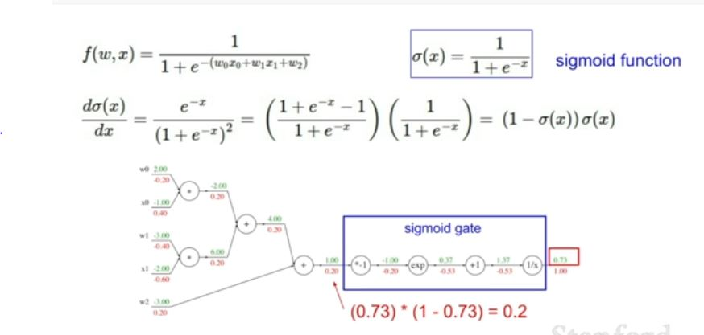

