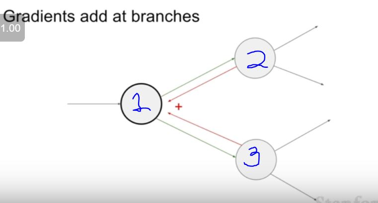

## Backpropagation and Neural Networks

We need to find df/dx ,  df/dy , df/dz

We start from the back calculating df/df which is equal to 1 . Then move backwards like df/dz , df/dq , df/dx , df/dy

### BackPropagation step by step

We can group together some compututional nodes to a more complex node. See the pic below.

### Backpropagation different gate meanings

So in max we give the previous grad value to the variables grad who have the highest value and other variables we give 0.

In mul/ multiply gate we just multiply the prev grad value to the opposite value of the current variable like for x = grad*y and for y = grad*x.

When gradient are like joining to a node from two different nodes we just add up the gradient coming from the two nodes to the node they a joining into 

Now the grad of node 1 is eual to gradient/grad of node 2 plus gradient of node 3.

Jacobian matrix is particial derivative of each output wrt to each input.

In practice we perform computation on 100s of inputs so jacobian is very large.

Our Jacobian matrix is going to be a diagonal matrix.

Forward we compute computational graph.
Backward we compute gradient.

 

 

 

## Neural Networks

Neural networks are just functions just stacked on layer by layer

 

 

