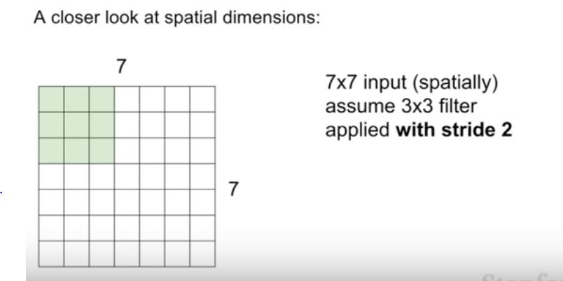
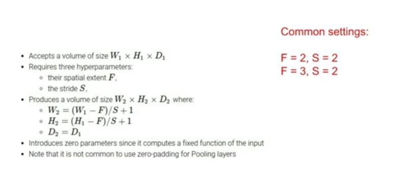

Difference between convolutional layer and this fully connected neural network is that in the convolutional case we want to preserve the spacial structure , instead of strecting it out into a one dimensional layer.

dot product gives a scalar value whereas cross product gives a vector

we strecth out both vector and multiple i.e.., flatten out the matrixes

We slide the 5*5*3 filter to each spatial space and take the dot product in the convolutional layer.

Convolutional Layer in working

Design Choice : Changing the stride

In practice we don't do strides for which our filter doesn't fit input layer because it may cause assymetric output.

Output size is measured by-

Don't take the values which gives decimal values.

In practice it is common to zero pad-
- all pixles even the corner ones will have a centre position.
- to make the output layer to the size we wanted.

In the above pic we have N=9 F=3 stride=1 
So we have 7*7 output layer after 0 padding!

We can 0 pad by any number to contain our stride

No. of Parameters - 5*5*3 for parameters +1 for the bias term so 76
then there are 10 filters so 76*10.

What is the intuition behind how we choose stride?
It downsamples and reduces the size of each layer , depends on the resolution.

Diff between conv and neural network is that now conv neuron only looks at a local area.

why we need to downsample?
- for fewer parameters
- detailed analysis of the area.

Usually we don't use zero padding for pooling layer.

- So the question is, now this looks like just a very small amount of information, right, so how can it know to classify it from here?
    - And so the way that you should think about this is that each of these values inside one of these pool outputs is actually, it's the accumulation of all the processing that you've done throughout this entire network, right. 
    - So it's at the very top of your hierarchy, and so each actually represents kind of a higher level concept. So we saw before, you know, 
    - for example, Hubel and Wiesel  and building up these hierarchical filters  where at the bottom level we're looking for edges, right, or things like very simple structures, like edges. 
    - And so after your convolutional layer the outputs that you see here in this first column is basically how much do specific, for example, edges, fire at different locations in the image. 
    - But then as you go through you're going to get more complex, it's looking for more complex things, right, and so the next convolutional layer is going to fire at how much, you know, 
    - let's say certain kinds of corners show up in the image, right, because it's reasoning. Its input is not the original image, its input is the output, it's already the edge maps, right, so it's reasoning on top of edge maps, and so that allows it to get more complex, detect more complex things. 
    - And so by the time you get all the way up to this last pooling layer, each value is representing how much a relatively complex sort of template is firing. 
    - Right, and so because of that now you can just have a fully connected layer, you're just aggregating all of this information together to get, you know, a score for your class. So each of these values is how much a pretty complicated complex concept is firing.

- So the question is, when do you know you've done enough pooling to do the classification? 
Design choices , try and see

Demo pf Conv

