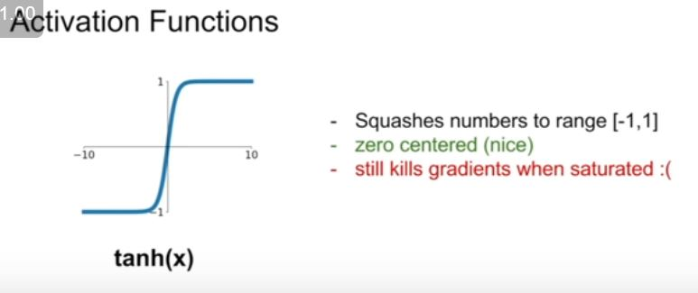

## Training Neural Network

### Sigmoid function

- What does the first problem means?

- x= -10 gradient is 0, kill off the gradient and not going to get gradient flow
- x= 0 gradient is ok
- x= 10 gradient is 0, kill off the gradient and not going to get gradient flow

Second problem with sigmoid func is -

Inefficient gradient updates , w will increase or decrease in the same direction, see the zig zag part we are only allowed to travel the w value in the red path , whereas we could have just travelled along blue line.

That why we need 0 mean so that we have +ve and -ve values and don't run into such problems.

Third problem with sigmoid func is -

### tanh

Looks similar to sigmoid difference is its zero centered.

### ReLU

Does not saturate in positive reason.

- x=10 ->linear
- x=0 -> undefined but in practice we say its 0
- x=-10 -> 0  killing the gradient

Bad relu reason

- bad initialization
- learning rate too high