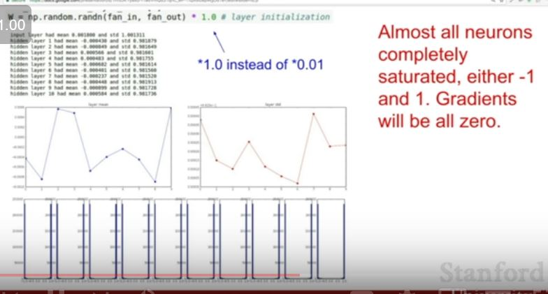

## Training Neural Network

### Sigmoid function

- What does the first problem means?

- x= -10 gradient is 0, kill off the gradient and not going to get gradient flow
- x= 0 gradient is ok
- x= 10 gradient is 0, kill off the gradient and not going to get gradient flow

Second problem with sigmoid func is -

Inefficient gradient updates , w will increase or decrease in the same direction, see the zig zag part we are only allowed to travel the w value in the red path , whereas we could have just travelled along blue line. Suboptimal Optimization.

That why we need 0 mean so that we have +ve and -ve values and don't run into such problems.

Third problem with sigmoid func is -

### tanh

Looks similar to sigmoid difference is its zero centered.

### ReLU

Does not saturate in positive reason.

- x=10 ->linear
- x=0 -> undefined but in practice we say its 0
- x=-10 -> 0  killing the gradient

Bad relu reason

- bad initialization
- learning rate too high

Saturated gradient becomes 0 so it does not updates the values.

How do you know whether the relu is dead or not wrt the data cloud?

- Not answered

People initialize ReLU with slighty positive biases in order to initialize and get active ReLU and get some updates.

### Modified ReLU

### ELU

### Maxout

### In practice

## Data Preprossesing

we do zero center to images.

We want to normalize so that all features are in the same range and they contribute equally.

For images we don't generally normalize images because pixles are usually of the same range. 

We don't do this in images.

In practice we ussually calculate mean and apply the same mean in test and train data.

We will have 3 means 1 mean for the green 1 for blue 1 for red

Mean is taken over all the training images

Data preprocessing does solve the zero mean problem for the first layer, but comes back at later layers 

## Weight Initialization

- All neurons will do the same thing
- same output 
- same gradient
- which we don't want
- we want neurons to learn different things.

It will work for small networks but can be problem for deeper networks.

- so our gradients are x and since x is small we are getting a small value and the gradients are not updating.

- If weights are big its going to be saturated regine of tanh.All gradients 0 and weights not updating.

Good initialization Xavier Initialization//Check it out in lecture notes

## Read papers to know about initializations

## Batch Normalizations

- Wanting to keep activations in the Gaussian Range.

-> did not understand the last picture

## Babysitting the Learning Process

### Step 2 

One best practice is that -
- start with a very small amount of data so we can overfit and get a good training loss
- turn of the regularization again and just see if we can make the loss go to zero.

We get NaN because our cost exploded and reason for this is our learning rate too high.

### Hyperparameter Optimization

 

And so the problem is that we can see that our best accuracy here has a learning rate that's about, you know, all of our good learning rates are in this E to the negative four range.

Right, and since the learning rate that we specified was going from 10 to the negative four to 10 to the zero, that means that all the good learning rates, were at the edge of the range that we were sampling. And so this is bad, because this means that we might not have explored our space sufficiently, right. We might actually want to go to 10 to the negative five, or 10 to the negative six. There might be still better ranges if we continue shifting down. So, you want to make sure that your range kind of has the good values somewhere in the middle, or somewhere where you get a sense that you've hit, you've explored your range fully. 

 

 we can sample all of our different hyperparameters, using a kind of grid search, right. We can sample for a fixed set of combinations, a fixed set of values for each hyperparameter. Sample in a grid manner over all of these values, but in practice it's actually better to sample from a random layout, so sampling random value of each hyperparameter in a range. And so what you'll get instead is we'll have these two hyper parameters here that we want to sample from. You'll get samples that look like this right side instead. And the reason for this is that if a function is really sort of more of a function of one variable than another, which is usually true. Usually we have little bit more, a lower effective dimensionality than we actually have. Then you're going to get many more samples of the important variable that you have. You're going to be able to see this shape in this green function that I've drawn on top, showing where the good values are, compared to if you just did a grid layout where we were only able to sample three values here, and you've missed where were the good regions. Right, and so basically we'll get much more useful signal overall since we have more samples of different values of the important variable. 

 

 

 

 

 

 

 Taking norm to measure how large they are

 