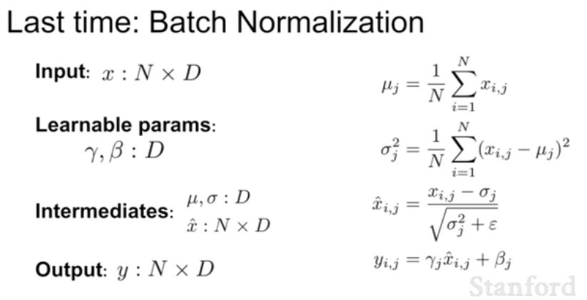
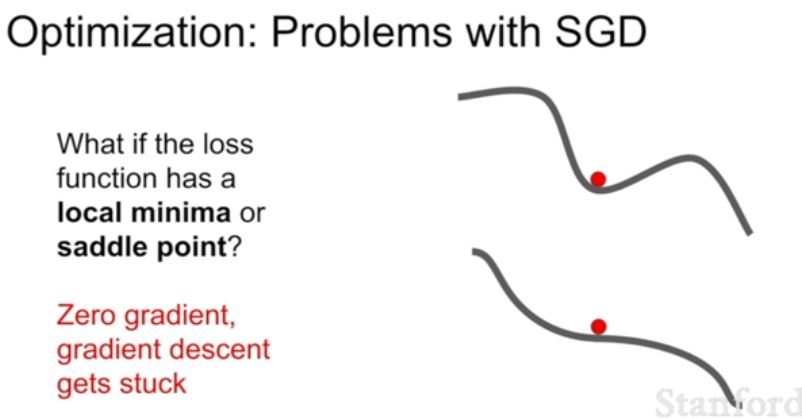
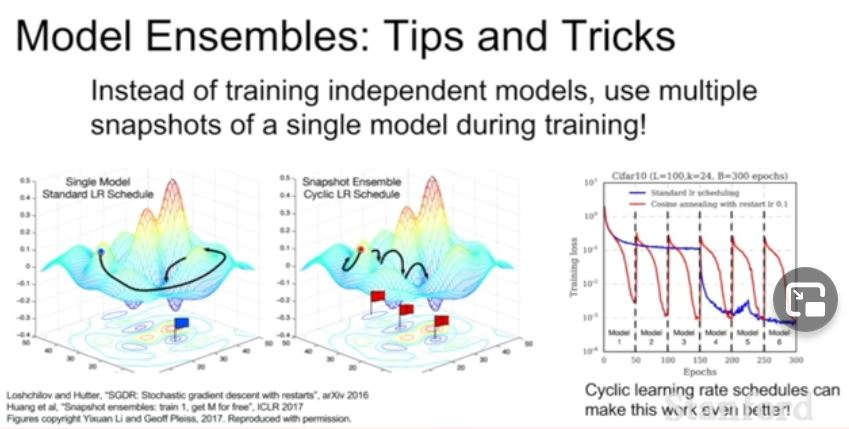
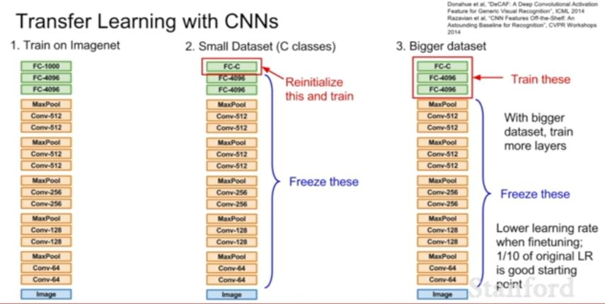

How many Hypermeter search at a time?
- Not too many at a time because search is exponential.
- Not 2 or more at first
- learning rate -> should be the first to search but its kinda promblem dependent.

Small learning rate and more epochs -> in theory works will take a lot of time.

## Problems with SGD-

- Imagine we have two w's and as we change one of the w the loss changes very slowly.
- loss landscape looks like a taco cell which is very sensitive in one direction and not the other
- red line behaviour is undesirerable where the loss function changes too much in the vertical direction and too little in horizontal.
- condition number : ration between the direction it had maximum difference to the ration with in the direction with lowest difference

- x-> one parameter
- y-> loss
- for the curved line
- now loss will stuck in the local minima and will stuck in a saddle point(at my current point some direction the loss goes down and some direction the loss goes up) and if i have humdred direction its going to happen almost in every direction.
- at local minima in both direction the loss goes up
- saddle points are much more common in more dimensions/parameters
- in neural network saddle points are the problem rather than local minima.
- one more probem is that near saddle point the gradient isn't 0 but the slope is very small what that means is we are going to make very slow progress near saddle points

- Because we are processing in batch we are not getting the whole info and gradient descent is sesitive towards noise and will take a lot of time

What does noise means?

New way to optimize or address the problems above is adding a term momentum to the SGD.

- The idea is that we introduce velocity and move in the direction of velocity rather than learning rate.
- rho is friction and we decay the velocity by rho and add it in our gradient.

- The intuition is that even in local minima if we don't have a gradient we atleast have velocity and it helps us moving forward. Similar logic goes for velocity.
- in horizontal direction our velocity will be built and we will cancel out the effect of vertical oscillations.
- Noise too it helps 

- The image in the left we calculate or gradient and velocity in the red point and then we take the weighted sum of both and get the actual step
- A slight variation of this is the Nesterov momentum where we take velocity at the point and at the velocity point we take the gradient and go back to the red point then work out the actual step. It helps in convex optimization. But does work as much when it comes to non convex problems like neural networks.
- velocity initialization always 0

## AdaGrad

- we square our gradient at each step and keep adding in the grad_squared term then when we compute the parameter vector we just divide it with grad squared.

- The idea is that if we have two coordinates, one that always has a very high gradient and one that always has a very small gradient, then as we add the sum of the squares of the small gradient, we're going to be dividing by a small number, so we'll accelerate movement along the slow dimension, along the one dimension. Then along the other dimension, where the gradients tend to be very large, then we'll be dividing by a large number, so we'll kind of slow down our progress along the wiggling dimension. 
- Problem is-

 - With AdaGrad, the steps actually get smaller and smaller and smaller because we just continue updating this estimate of the squared gradients over time, so this estimate just grows and grows and grows monotonically over the course of training. Now this causes our step size to get smaller and smaller and smaller over time. Again, in the convex case, there's some really nice theory showing that this is actually really good 'cause in the convex case, as you approach a minimum, you kind of want to slow down so you actually converge. That's actually kind of a feature in the convex case. But in the non-convex case, that's a little bit problematic because as you come towards a saddle point, you might get stuck with AdaGrad, and then you kind of no longer make any progress. 

## Slight Variation of  : RMSProp

- we introduce a decay rate , kinda like momentum
- decay rate usually 0.9 or 0.99

We tend to not use AdaGrad when training neural network that much.

## ADAM

Adam is the mixture of both momentum and adaGrad and RMSProp

That's the question of what happens at the very first time step? At the very first time step, you can see that at the beginning, we've initialized our second moment with zero. Now after one update of the second moment, typically this beta two, second moment decay rate, is something like .9 or .99, something very close to one. After one update, our second moment is still very, very close to zero. Now when we're making our update step here and we divide by our second moment, now we're dividing by a very small number. We're making a very, very large step at the beginning. This very, very large step at the beginning is not really due to the geometry of the problem. It's kind of an artifact of the fact that we initialized our second moment estimate was zero. 

- The idea is what is this 10 to the minus seven term in the last equation? That's actually appeared in AdaGrad, RMSProp and Adam. The idea is that we're dividing by something. We want to make sure we're not dividing by zero, so we always add a small positive constant to the denominator, just to make sure we're not dividing by zero. That's technically a hyperparameter, but it tends not to matter too much, so just setting 10 to minus seven, 10 to minus eight, something like that, tends to work well. 

- Adam also adds this bias correction term to avoid this problem of taking very large steps at the beginning. You can see that after we update our first and second moments, we create an unbiased estimate of those first and second moments by incorporating the current time step, t. Now we actually make our step using these unbiased estimates, rather than the original first and second moment estimates. This gives us our full form of Adam. 

-  In particular, if you set beta one equals .9, beta two equals .999, learning rate one e minus three or five e minus four, that's a great staring point for just about all the architectures

- The question is what does Adam not fix?
Would these neural networks are still large, they still take a long time to train. There can still be a problem. In this picture where we have this landscape of things looking like ovals, if you imagine that we're kind of making estimates along each dimension independently to allow us to speed up or slow down along different coordinate axes, but one problem is that if that taco shell is kind of tilted and is not axis aligned, then we're still only making estimates along the individual axes independently. That corresponds to taking your rotated taco shell and squishing it horizontally and vertically, but you can't actually unrotate it. In cases where you have this kind of rotated picture of poor conditioning, then Adam or any of these other algorithms really can't address that, that concern. 

## Learning Rates

- What's going on in these plots is that they're using a step decay learning rate, where at these parts where it plateaus and then suddenly drops again, those are the iterations where they dropped the learning rate by some factor. This idea of dropping the learning rate, you might imagine that it got near some good region, but now the gradients got smaller, it's kind of bouncing around too much. Then if we drop the learning rate, it lets it slow down and continue to make progress down the landscape. 

- learning rate decay is a little bit more common with SGD momentum, and a little bit less common with something like Adam. 
- learning rate decay is kind of a second-order hyperparameter. 
-  What you do for setting learning rate decay is try with no decay, see what happens. Then kind of eyeball the loss curve and see where you think you might need decay. 

So we use the first order derivative but sometimes the steps are too large and we don't want to do that

Another fancier method is the second order derivative and it does not have a learning rate but in practice we need to keep a learning rate because we don't want to step in the minimum we want to go in the direction of minimum

But the hessian method is inpractical because of large matrix and lots of computation.

But in practice this does not work very well with the deep learning as inpractice this does not handle stochastic case very well also not ideal for non conves cases.

- The question is, it's bad when there's a large gap between error 'cause that means you're overfitting, but if there's no gap, then is that also maybe bad? Do we actually want some small, optimal gap between the two? We don't really care about the gap. What we really care about is maximizing the performance on the validation set. What tends to happen is that if you don't see a gap, then you could have improved your absolute performance, in many cases, by overfitting a little bit more. There's this weird correlation between the absolute performance on the validation set and the size of that gap. We only care about absolute performance. 

Not too common the trick

L2 regularization doesn't make a lot of sense for neural networks.

## Dropout

We use dropout only when our model is overfitting, which in computer vision case is very common because we have so many parameters and compared to that we don't always has enough data.

One thing we can do is check without dropout by keeping p as 1

 - The question is what are we setting to zero? It's the activations. Each layer is computing previous activation times the weight matrix gives you our next activation. Then you just take that activation, set some of them to zero, and then your next layer will be partially zeroed activations times another matrix give you your next activations. 

 - Question is which layers do you do this on? It's more common in fully connected layers, but you sometimes see this in convolutional layers, as well. When you're working in convolutional layers, sometimes instead of dropping each activation randomly, instead you sometimes might drop entire feature maps randomly. In convolutions, you have this channel dimension, and you might drop out entire channels, rather than random elements. 

- One sort of slightly hand wavy idea that people have is that dropout helps prevent co-adaptation of features. Maybe if you imagine that we're trying to classify cats, maybe in some universe, the network might learn one neuron for having an ear, one neuron for having a tail, one neuron for the input being furry. Then it kind of combines these things together to decide whether or not it's a cat. But now if we have dropout, then in making the final decision about catness, the network cannot depend too much on any of these one features. Instead, it kind of needs to distribute its idea of catness across many different features. This might help prevent overfitting somehow.

- By the way, one common trick you see sometimes is this idea of inverted dropout. Maybe at test time, you care more about efficiency, so you want to eliminate that extra multiplication by p at test time. Then what you can do is, at test time, you use the entire weight matrix, but now at training time, instead you divide by p because training is probably happening on a GPU. You don't really care if you do one extra multiply at training time, but then at test time, you kind of want this thing to be as efficient as possible. 

stochasticity or noise

- Dropout is somewhat nice because you can actually tune the regularization strength by varying that parameter p, and there's no such control in batch normalization. 

## Transfer Learning

- One problem with overfitting is sometimes you overfit 'cause you don't have enough data. You want to use a big, powerful model, but that big, powerful model just is going to overfit too much on your small dataset. Regularization is one way to combat that, but another way is through using transfer learning. Transfer learning kind of busts this myth that you don't need a huge amount of data in order to train a CNN. 

- The idea is really simple. You'll maybe first take some CNN. Here is kind of a VGG style architecture. You'll take your CNN, you'll train it in a very large dataset, like ImageNet, where you actually have enough data to train the whole network. Now the idea is that you want to apply the features from this dataset to some small dataset that you care about. Maybe instead of classifying the 1,000 ImageNet categories, now you want to classify 10 dog breeds or something like that. You only have a small dataset. Here, our small dataset only has C classes. Then what you'll typically do is for this last fully connected layer that is going from the last layer features to the final class scores, this now, you need to reinitialize that matrix randomly. For ImageNet, it was a 4,096-by-1,000 dimensional matrix. Now for your new classes, it might be 4,096-by-C or by 10 or whatever. You reinitialize this last matrix randomly, freeze the weights of all the previous layers and now just basically train a linear classifier, and only train the parameters of this last layer and let it converge on your data. This tends to work pretty well if you only have a very small dataset to work with. Now if you have a little bit more data, another thing you can try is actually fine tuning the whole network. After that top layer converges and after you learn that last layer for your data, then you can consider actually trying to update the whole network, as well. If you have more data, then you might consider updating larger parts of the network. A general strategy here is that when you're updating the network, you want to drop the learning rate from its initial learning rate because probably the original parameters in this network that converged on ImageNet probably worked pretty well generally, and you just want to change them a very small amount to tune performance for your dataset.

Here very different and very similar are like our data similar  or different from imagenet data

- xray of animals - different from imagenet.

