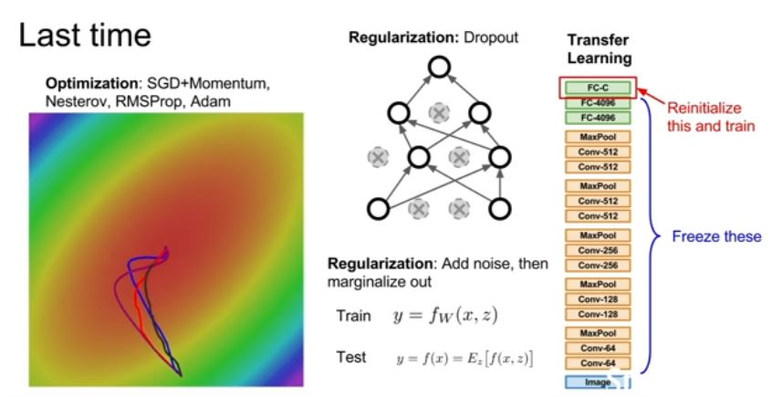
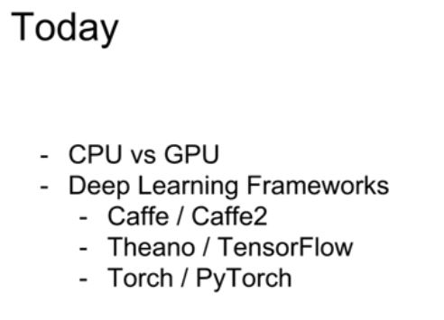
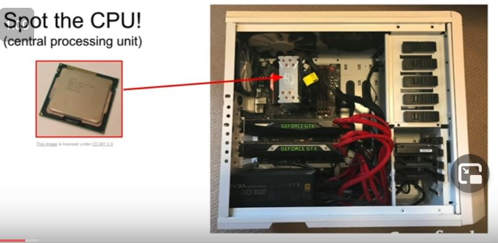
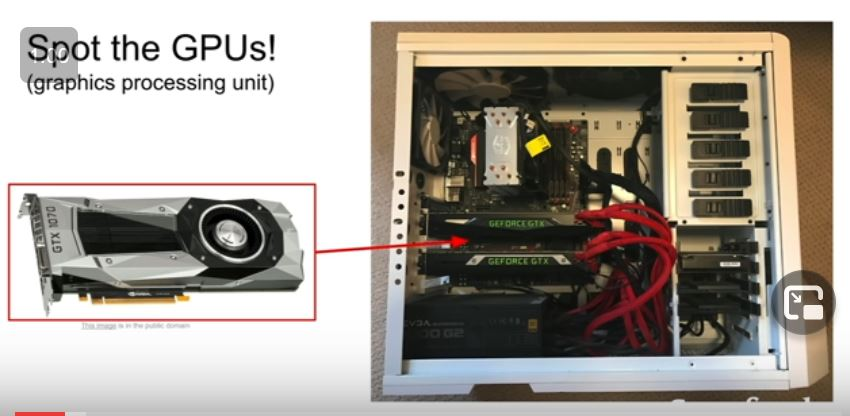
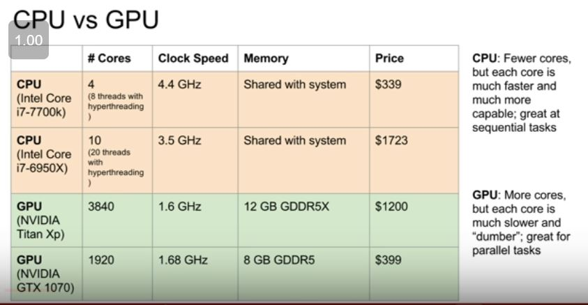

## CPU vs GPU

### Nvdia vs AMD

In deep learning we prefer Nvdia.

And there's a couple general trends to notice here. -
-  Both GPUs and CPUs are kind of a general purpose computing machine where they can execute programs and do sort of arbitrary instructions, but they're qualitatively pretty different. 
-  So CPUs tend to have just a few cores, for consumer desktop CPUs these days, they might have something like four or six or maybe up to 10 cores. 
-  With hyperthreading technology that means they can run, the hardware can physically run, like maybe eight or up to 20 threads concurrently. 
- So the CPU can maybe do 20 things in parallel at once. 
-  Every CPU instruction can actually do quite a lot of stuff. And they can all work pretty independently.
-  top end consumer GPUs have thousands of cores. 
- The downside of a GPU is that each of those cores, one, it runs at a much slower clock speed. 
- The GPU cores can't really operate very independently.They all kind of need to work together and sort of paralyze one task across many cores rather than each core totally doing its own thing. 
- But it should give you the sense that due to the large number of cores GPUs can sort of, are really good for parallel things where you need to do a lot of things all at the same time, but those things are all pretty much the same flavor. 
- CPUs have some cache on the CPU, but that's relatively small and the majority of the memory for your CPU is pulling from your system memory, the RAM, which will maybe be like eight, 12, 16, 32 gigabytes of RAM on a typical consumer desktop these days. 
-  Whereas GPUs actually have their own RAM built into the chip. 
- so the GPUs typically have their own relatively large block of memory within the card itself. 
-  GPUs also have their own caching system where there are sort of multiple hierarchies of caching between the 12 gigabytes of GPU memory and the actual GPU cores. 

> GPU can do Matrix multiplication very fast
*hello*