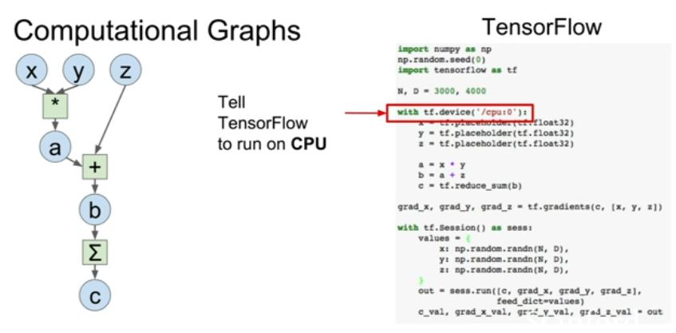

## CPU vs GPU

### Nvdia vs AMD

In deep learning we prefer Nvdia.

And there's a couple general trends to notice here. -
-  Both GPUs and CPUs are kind of a general purpose computing machine where they can execute programs and do sort of arbitrary instructions, but they're qualitatively pretty different. 
-  So CPUs tend to have just a few cores, for consumer desktop CPUs these days, they might have something like four or six or maybe up to 10 cores. 
-  With hyperthreading technology that means they can run, the hardware can physically run, like maybe eight or up to 20 threads concurrently. 
- So the CPU can maybe do 20 things in parallel at once. 
-  Every CPU instruction can actually do quite a lot of stuff. And they can all work pretty independently.
-  top end consumer GPUs have thousands of cores. 
- The downside of a GPU is that each of those cores, one, it runs at a much slower clock speed. 
- The GPU cores can't really operate very independently.They all kind of need to work together and sort of paralyze one task across many cores rather than each core totally doing its own thing. 
- But it should give you the sense that due to the large number of cores GPUs can sort of, are really good for parallel things where you need to do a lot of things all at the same time, but those things are all pretty much the same flavor. 
- CPUs have some cache on the CPU, but that's relatively small and the majority of the memory for your CPU is pulling from your system memory, the RAM, which will maybe be like eight, 12, 16, 32 gigabytes of RAM on a typical consumer desktop these days. 
-  Whereas GPUs actually have their own RAM built into the chip. 
- so the GPUs typically have their own relatively large block of memory within the card itself. 
-  GPUs also have their own caching system where there are sort of multiple hierarchies of caching between the 12 gigabytes of GPU memory and the actual GPU cores. 

> GPU can do Matrix multiplication very fast

- So you could imagine that for a GPU you can just like blast this out and have all of this elements of the output matrix all computed in parallel and that could make this thing computer super super fast on GPU. So that's kind of the prototypical type of problem that like where a GPU is really well suited, where a CPU might have to go in and step through sequentially and compute each of these elements one by one. 

-  CPUs these days have multiple cores, they can do vectorized instructions as well, but still, for these like massively parallel problems GPUs tend to have much better throughput. 

## Deep Learning Frameworks

Numpy doesn't work on gpu

img27 no data in the system yet.

 So TensorFlow just expects to receive data from Numpy arrays in most cases. So here we're just creating concrete actual values for X, Y, w1 and w2 using Numpy and then storing these in some dictionary. And now here is where we're actually running the graph. So you can see that we're calling a session.run to actually execute some part of the graph. 

 The first argument loss, tells us which part of the graph do we actually want as output. And that, so we actually want the graph, in this case we need to tell it that we actually want to compute loss and grad1 and grad w2 and we need to pass in with this feed dict parameter the actual concrete values that will be fed to the graph. 

 And then after, in this one line, it's going and running the graph and then computing those values for loss grad1 to grad w2 and then returning the actual concrete values for those in Numpy arrays again. 

 So here, remember that on the forward pass, every time we execute this graph, we're actually feeding in the weights. We have the weights as Numpy arrays and we're explicitly feeding them into the graph. And now when the graph finishes executing it's going to give us these gradients. And remember the gradients are the same size as the weights. So this means that every time we're running the graph here, we're copying the weights from Numpy arrays into TensorFlow then getting the gradients and then copying the gradients from TensorFlow back out to Numpy arrays. So if you're just running on CPU, this is maybe not a huge deal, but remember we talked about CPU GPU bottleneck and how it's very expensive actually to copy data between CPU memory and GPU memory. So if your network is very large and your weights and gradients were very big, then doing something like this would be super expensive and super slow because we'd be copying all kinds of data back and forth between the CPU and the GPU at every time step. So that's bad, we don't want to do that. We need to fix that. 

 So a variable is something is a value that lives inside the computational graph and it's going to persist inside the computational graph across different times when you run the same graph. So now instead of declaring these w1 and w2 as placeholders, instead we just construct them as variables. But now since they live inside the graph, we also need to tell TensorFlow how they should be initialized, right? Because in the previous case we were feeding in their values from outside the graph, so we initialized them in Numpy, but now because these things live inside the graph, TensorFlow is responsible for initializing them. So we need to pass in a tf.randomnormal operation, which again is not actually initializing them when we run this line, this is just telling TensorFlow how we want them to be initialized. 

There exists a bug

Not performing upadtes on w1 and w2.

We can do this too but this is a problem too.

So one thing we could do, which is what was suggested is we could add new w1 and new w2 as outputs and just tell TensorFlow that we want to produce

these values as outputs. 
But that's a problem too because the values, those new w1, new w2 values are again these big tensors. So now if we tell TensorFlow we want those as output, we're going to again get this copying behavior between CPU and GPU at ever iteration. So that's bad, we don't want that. 

 So there's a little trick you can do instead. Which is that we add kind of a dummy node to the graph. With these fake data dependencies and we just say that this dummy node updates, has these data dependencies of new w1 and new w2. And now when we actually run the graph, we tell it to compute both the loss and this dummy node. And this dummy node doesn't actually return any value it just returns none, but because of this dependency that we've put into the node it ensures that when we run the updates value, we actually also run these update operations. 

 So, question? [student's words obscured due to lack of microphone] Is there a reason why we didn't put X and Y into the graph? And that it stayed as Numpy. So in this example we're reusing X and Y on every, we're reusing the same X and Y on every iteration. So you're right, we could have just also stuck those in the graph, but in a more realistic scenario, X and Y will be minibatches of data so those will actually change at every iteration and we will want to feed different values for those at every iteration. So in this case, they could have stayed in the graph, but in most cases they will change, so we don't want them to live in the graph. 

 Yeah, so we've told it, we had put into TensorFlow that the outputs we want are loss and updates. Updates is not actually a real value. So when updates evaluates it just returns none. But because of this dependency we've told it that updates depends on these assign operations. But these assign operations live inside the computational graph and all live inside GPU memory. So then we're doing these update operations entirely on the GPU and we're no longer copying the updated values back out of the graph. 

 tf.GlobalVariablesInitializer is causing the tf.randomnormal to actually run and generate concrete values to initialize those variables. 

 

### Pytorch

 PyTorch and TensorFlow is that in a TensorFlow case we were building up this explicit graph, then running the graph many times. Here in PyTorch, instead we're building up a new graph every time we do a forward pass. And this makes the code look a bit cleaner. 