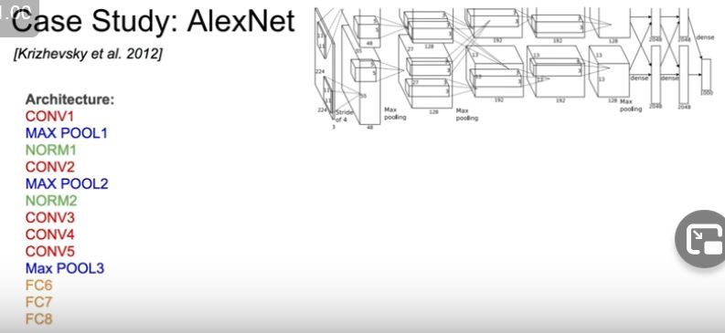
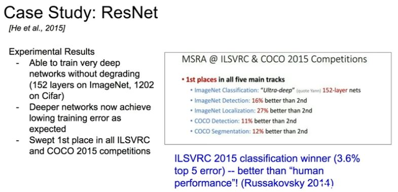

- Lennet successfully applied in a convolutional neural network

## AlexNet

- First large scale convnet that started the convnet research performed very well in imagenet classification.

- Ans - 55 x 55 x 96

- Pooling layer has no parameters.

- So if you were to stack three three by three conv layers with Stride one what's the effective receptive field, the total area of the input, spatial area of the input that enure at the top layer of the three layers is looking at. 
- Okay, so the reason given was because they overlap. 
- So it's on the right track. What actually is happening though is you have to see, at the first layer, the receptive field is going to be three by three right? 
- And then at the second layer, each of these neurons in the second layer is going to look at three by three other first layer filters, but the corners of these three by three have an additional pixel on each side, that is looking at in the original input layer. 
- So the second layer is actually looking at five by five receptive field and then if you do this again, the third layer is looking at three by three in the second layer but this is going to, if you just draw out this pyramid is looking at seven by seven in the input layer. 
- So the effective receptive field here is going to be seven by seven. Which is the same as one seven by seven conv layer. 
- So what happens is that this has the same effective receptive field as a seven by seven conv layer but it's deeper. It's able to have more non-linearities in there, and it's also fewer parameters. 
- So if you look at the total number of parameters, each of these conv filters for the three by threes is going to have nine parameters in each conv [mumbles] three times three, and then times the input depth, so three times three times C, times this total number of output feature maps, which is again C is we're going to preserve the total number of channels. So you get three times three, times C times C for each of these layers, and we have three layers so it's going to be three times this number, compared to if you had a single seven by seven layer then you get, by the same reasoning, seven squared times C squared. So you're going to have fewer parameters total, which is nice. 

- VGG - 120 million parameters
- Alexnet - 60 million parameters
- deeper always refering to layers -  So the total number of layers with trainable weight, so convolutional layers and fully connected layers. 

- is there intuition behind, as you go deeper into the network we have more channel depth so more number of filters right and so you can have any design that you want so you don't have to do this. In practice you will see this happen a lot of the times and one of the reasons is people try and maintain kind of a relatively constant level of compute, so as you go higher up or deeper into your network, you're usually also using basically down sampling and having smaller total spatial area and then so then they also increase now you increase by depth a little bit, it's not as expensive now to increase by depth because it's spatially smaller and so, yeah that's just a reason. 

- Okay, so the question is what is localization here? And so this is a task, and we'll talk about it a little bit more in a later lecture on detection and localization so I don't want to go into detail here but it's basically an image, not just classifying What's the class of the image, but also drawing a bounding box around where that object is in the image. And the difference with detection, which is a very related task is that detection there can be multiple instances of this object in the image localization we're assuming there's just one, this classification but we just how this additional bounding box. 

- how are we getting 28 by 28 for everything? So here we're doing all the zero padding in order to maintain the spatial dimensions, and that way we can do this filter concatenation depth-wise.

- operations are very expensive 854 million operations

-  And so one of the key insights that GoogleNet used was that well we can we can address this by using bottleneck layers and try and project these feature maps to lower dimension before our our convolutional operations, so before our expensive layers. 

 So reminder one by one convolution, I guess we were just going through this but it's taking your input volume, it's performing a dot product at each spatial location and what it does is it preserves spatial dimension but it reduces the depth and it reduces that by projecting your input depth to a lower dimension. It just takes it's basically like a linear combination of your input feature maps. 

 So now basically what's happening is that we still have the same input here 28 by 28 by 256, but these one by one convs are going to reduce the depth dimension and so you can see before the three by three convs, if I put a one by one conv with 64 filters, my output from that is going to be, 28 by 28 by 64. So instead of now going into the three by three convs afterwards instead of 28 by 28 by 256 coming in, we only have a 28 by 28, by 64 block coming in. And so this is now reducing the smaller input going into these conv layers, the same thing for the five by five conv, and then for the pooling layer, after the pooling comes out, we're going to reduce the depth after this. And so, if you work out the math the same way for all of the convolutional ops here, adding in now all these one by one convs on top of the three by threes and five by fives, the total number of operations is 358 million operations, so it's much less than the 854 million that we had 

 what information might be lost by doing this one by one conv at the beginning. And so there might be some information loss, but at the same time if you're doing these projections you're taking a linear combination of these input feature maps which has redundancy in them, you're taking combinations of them, and you're also introducing an additional non-linearity after the one by one conv, so it also actually helps in that way with adding a little bit more depth and so, I don't think there's a rigorous analysis of this, but basically in general this works better and there's reasons why it helps as well. 

 So what we start with is we first have this stem network, so this is more the kind of vanilla plain conv net that we've seen earlier six sequence of layers. So conv pool a couple of convs in another pool just to get started and then after that we have all of our different our multiple inception modules all stacked on top of each other, and then on top we have our classifier output. And notice here that they've really removed the expensive fully connected layers it turns out that the model works great without them, even and you reduce a lot of parameters. And then what they also have here is, you can see these couple of extra stems coming out and these are auxiliary classification outputs and so these are also you know just a little mini networks with an average pooling, a one by one conv, a couple of fully connected layers here going to the soft Max and also a 1000 way SoftMax with the ImageNet classes. And so you're actually using your ImageNet training classification loss in three separate places here. The standard end of the network, as well as in these two places earlier on in the network, and the reason they do that is just this is a deep network and they found that having these additional auxiliary classification outputs, you get more gradient training injected at the earlier layers, and so more just helpful signal flowing in because these intermediate layers should also be helpful. You should be able to do classification based off some of these as well. And so this is the full architecture, there's 22 total layers with weights and so within each of these modules each of those one by one, three by three, five by five is a weight layer, just including all of these parallel layers, and in general it's a relatively more carefully designed architecture and part of this is based on some of these intuitions that we're talking about and part of them also is just you know Google the authors they had huge clusters and they're cross validating across all kinds of design choices and this is what ended up working well. 

56 layer network doing worst than the 20 layer not a problem of overfitting

- So the question is what exactly do we mean by residual this output of this transformation is a residual? So we can think of our output here right as this F of X plus X, where F of X is the output of our transformation and then X is our input, just passed through by the identity. So we'd like to using a plain layer, what we're trying to do is learn something like H of X, but what we saw earlier is that it's hard to learn H of X. It's a good H of X as we get very deep networks. And so here the idea is let's try and break it down instead of as H of X is equal to F of X plus, and let's just try and learn F of X. And so instead of learning directly this H of X we just want to learn what is it that we need to add or subtract to our input as we move on to the next layer. So you can think of it as kind of modifying this input, in place in a sense. 

- So the question is in practice do we just sum F of X and X together, or do we learn some weighted combination and you just do a direct sum. Because when you do a direct sum, this is the idea of let me just learn what is it I have to add or subtract onto X. 

why is it that learning the residual should be easier than learning the direct mapping? And so this is just their hypotheses, and a hypotheses is that if we're learning the residual you just have to learn what's the delta to X right? And if our hypotheses is that generally even something like our solution by construction, where we had some number of these shallow layers that were learned and we had all these identity mappings at the top this was a solution that should have been good, and so that implies that maybe a lot of these layers, actually something just close to identity, would be a good layer And so because of that, now we formulate this as being able to learn the identity plus just a little delta. And if really the identity is best we just make F of X squashes transformation to just be zero, which is something that's relatively, might seem easier to learn, also we're able to get things that are close to identity mappings. And so again this is not something that's necessarily proven or anything it's just the intuition and hypothesis, and then we'll also see later some works where people are actually trying to challenge this and say oh maybe it's not actually the residuals that are so necessary, but at least this is the hypothesis for this paper, and in practice using this model, it was able to do very well. 

