# Recurrent Neural Networks

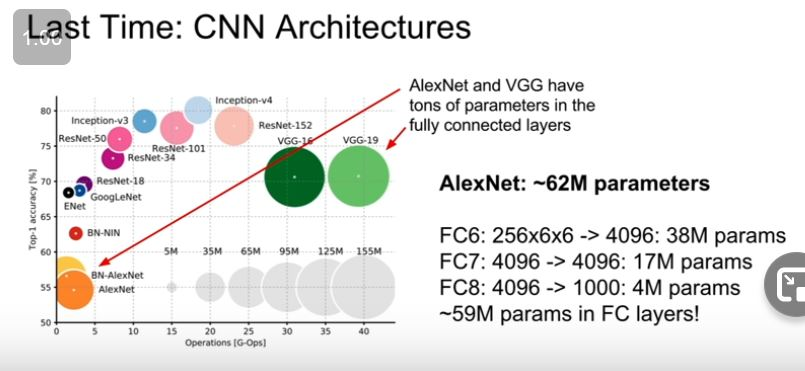

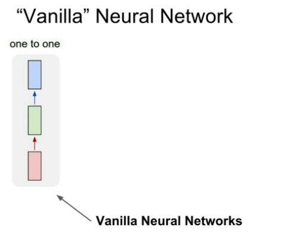

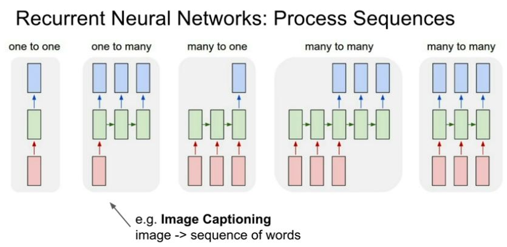

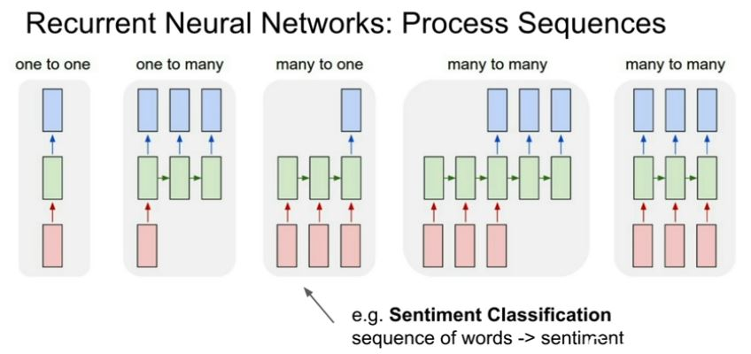

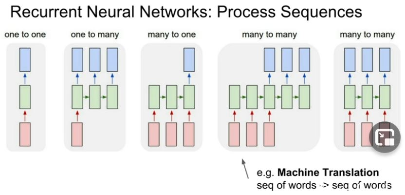

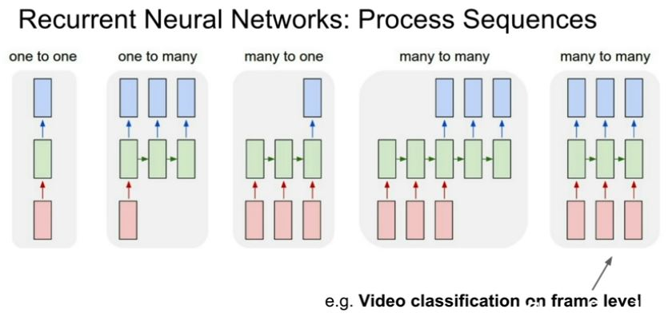

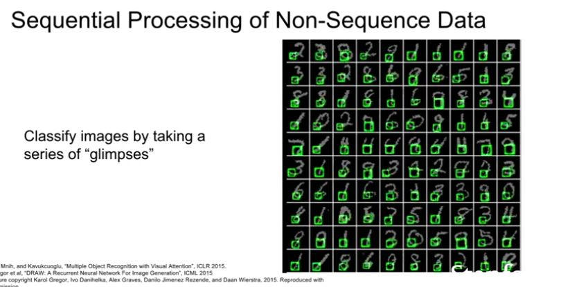

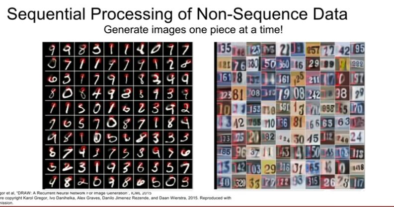

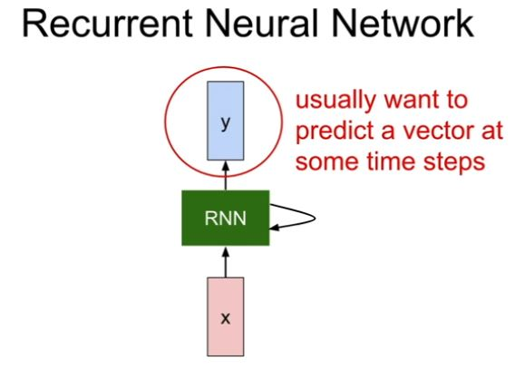

-  So in general, a recurrent neural network is this little, has this little recurrent core cell and it will take some input x, feed that input into the RNN, and that RNN has some internal hidden state, and that internal hidden state will be updated every time that the RNN reads a new input. And that internal hidden state will be then fed back to the model the next time it reads an input. And frequently, we will want our RNN"s to also produce some output at every time step, so we'll have this pattern where it will read an input, update its hidden state, and then produce an output. 

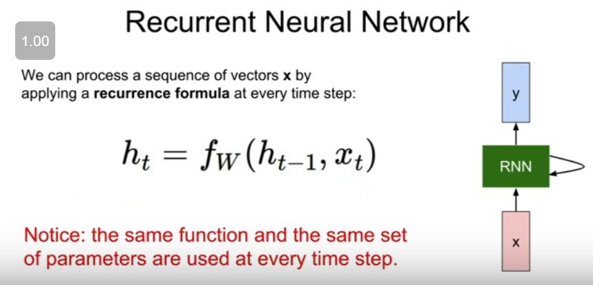

- So inside this little green RNN block, we're computing some recurrence relation, with a function f. So this function f will depend on some weights, w. It will accept the previous hidden state, h t - 1, as well as the input at the current state, x t, and this will output the next hidden state, or the updated hidden state, that we call h t. And now, then as we read the next input, this hidden state, this new hidden state, h t, will then just be passed into the same function as we read the next input, x t plus one. And now, if we wanted to produce some output at every time step of this network, we might attach some additional fully connected layers that read in this h t at every time step. And make that decision based on the hidden state at every time step. 

-  we use the same function, f w, and the same weights, w, at every time step of the computation. 

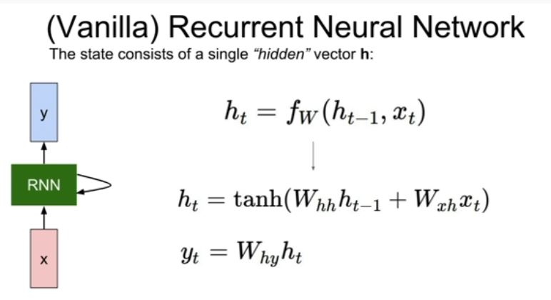

- So here, we have this same functional form from the previous slide, where we're taking in our previous hidden state and our current input and we need to produce the next hidden state. And the kind of simplest thing you might imagine is that we have some weight matrix, w x h, that we multiply against the input, x t, as well as another weight matrix, w h h, that we multiply against the previous hidden state. So we make these two multiplications against our two states, add them together, and squash them through a tanh, so we get some kind of non linearity in the system. 

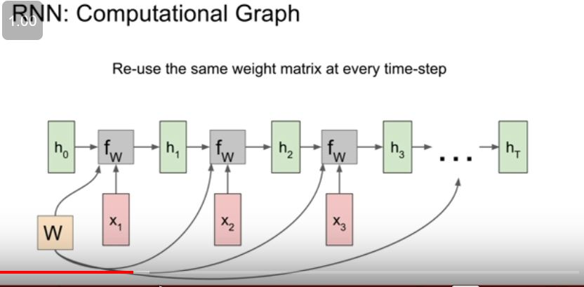

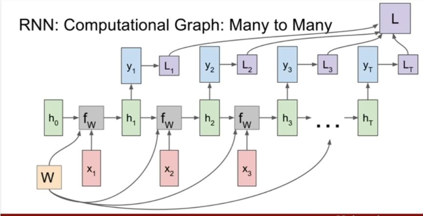

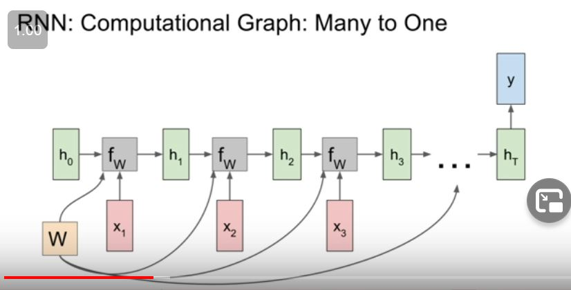

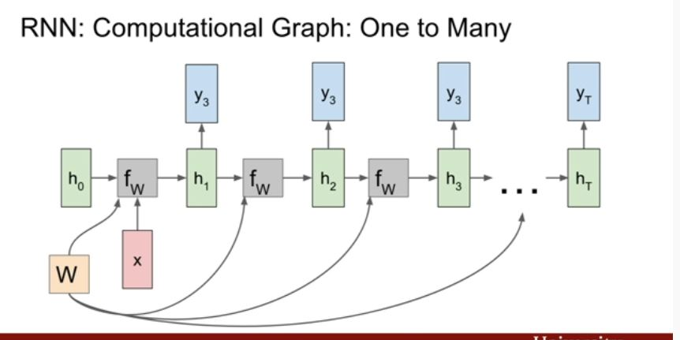

- Many to many

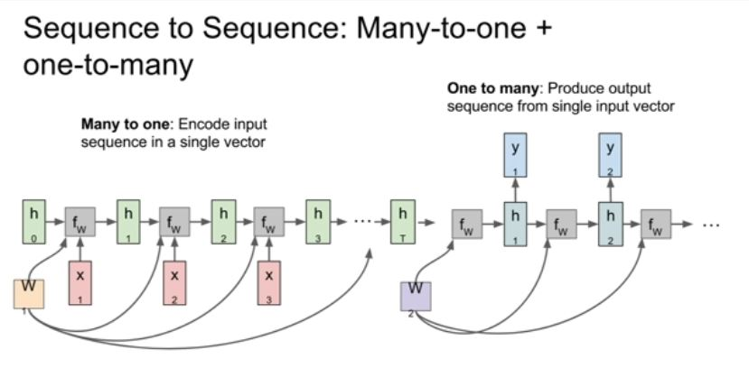

So, we'll kind of proceed in two stages, what we call an encoder and a decoder. So if you're the encoder, we'll receive the variably sized input, which might be your sentence in English, and then summarize that entire sentence using the final hidden state of the encoder network. And now we're in this many to one situation where we've summarized this entire variably sized input in this single vector, and now, we have a second decoder network, which is a one to many situation, which will input that single vector summarizing the input sentence and now produce this variably sized output, which might be your sentence in another language. And now in this variably sized output, we might make some predictions at every time step, maybe about what word to use. And you can imagine kind of training this entire thing by unrolling this computational graph summing the losses at the output sequence and just performing back propagation, as usual. 

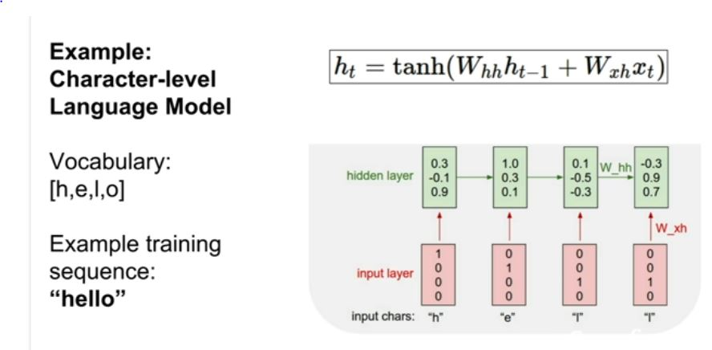

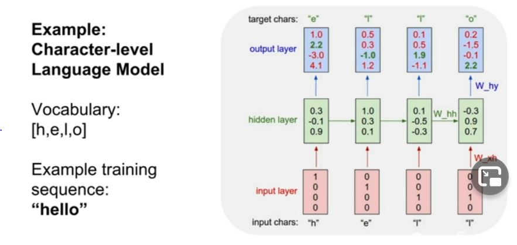

h goes to the rnn and the model predicts which letter to come next.

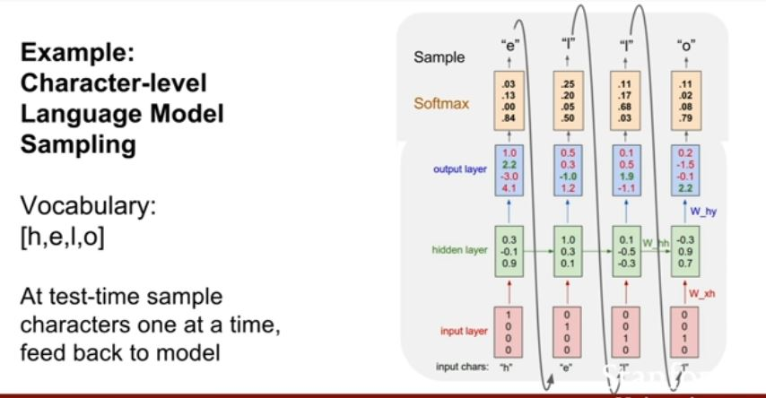

- And now, if you think about what happens at test time, after we train this model, one thing that we might want to do with it is a sample from the model, and actually use this trained neural network model to synthesize new text that kind of looks similar in spirit to the text that it was trained on. The way that this will work is we'll typically see the model with some input prefix of text. In this case, the prefix is just the single letter h, and now we'll feed that letter h through the first time step of our recurrent neural network. It will product this distribution of scores over all the characters in the vocabulary. Now, at training time, we'll use these scores to actually sample from it. So we'll use a softmaxt function to convert those scores into a probability distribution and then we will sample from that probability distribution to actually synthesize the second letter in the sequence. And in this case, even though the scores were pretty bad, maybe we got lucky and sampled the letter e from this probability distribution. And now, we'll take this letter e that was sampled from this distribution and feed it back as input into the network at the next time step. Now, we'll take this e, pull it down from the top, feed it back into the network as one of these, sort of, one hot vectorial representations, and then repeat the process in order to synthesize the second letter in the output. And we can repeat this process over and over again to synthesize a new sequence using this trained model, where we're synthesizing the sequence one character at a time using these predicted probability distributions at each time step. Question? Yeah, that's a great question. So the question is why might we sample instead of just taking the character with the largest score? In this case, because of the probability distribution that we had, it was impossible to get the right character, so we had the sample so the example could work out, and it would make sense. But in practice, sometimes you'll see both. So sometimes you'll just take the argmax probability, and that will sometimes be a little bit more stable, but one advantage of sampling, in general, is that it lets you get diversity from your models. Sometimes you might have the same input, maybe the same prefix, or in the case of image captioning, maybe the same image. But then if you sample rather than taking the argmax, then you'll see that sometimes these trained models are actually able to produce multiple different types of reasonable output sequences, depending on the kind, depending on which samples they take at the first time steps. It's actually kind of a benefit cause we can get now more diversity in our outputs. 

at test time, could we feed in this whole softmax vector rather than a one hot vector? There's kind of two problems with that. One is that that's very different from the data that it saw at training time. In general, if you ask your model to do something at test time, which is different from training time, then it'll usually blow up. It'll usually give you garbage and you'll usually be sad. The other problem is that in practice, our vocabularies might be very large. So maybe, in this simple example, our vocabulary is only four elements, so it's not a big problem. But if you're thinking about generating words one at a time, now your vocabulary is every word in the English language, which could be something like tens of thousands of elements. So in practice, this first element, this first operation that's taking in this one hot vector, is often performed using sparse vector operations rather than dense factors. It would be, sort of, computationally really bad if you wanted to have this load of 10,000 elements softmax vector. So that's usually why we use a one hot instead, even at test time. 

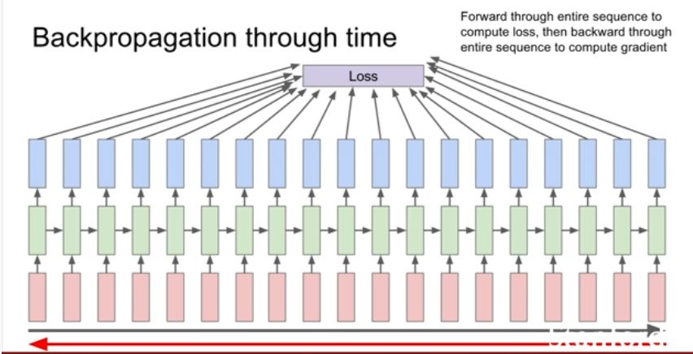

 This idea that we have a sequence and we produce an output at every time step of the sequence and then finally compute some loss, this is sometimes called backpropagation through time because you're imagining that in the forward pass, you're kind of stepping forward through time and then during the backward pass, you're sort of going backwards through time to compute all your gradients. This can actually be kind of problematic if you want to train the sequences that are very, very long. So if you imagine that we were kind of trying to train a neural network language model on maybe the entire text of Wikipedia, which is, by the way, something that people do pretty frequently, this would be super slow, and every time we made a gradient step, we would have to make a forward pass through the entire text of all of wikipedia, and then make a backward pass through all of wikipedia, and then make a single gradient update. And that would be super slow. Your model would never converge. It would also take a ridiculous amount of memory so this would be just really bad. In practice, what people do is this, sort of, approximation called truncated backpropagation through time. 

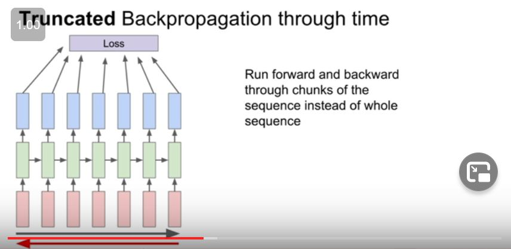

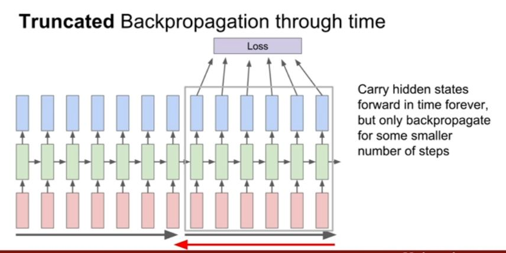

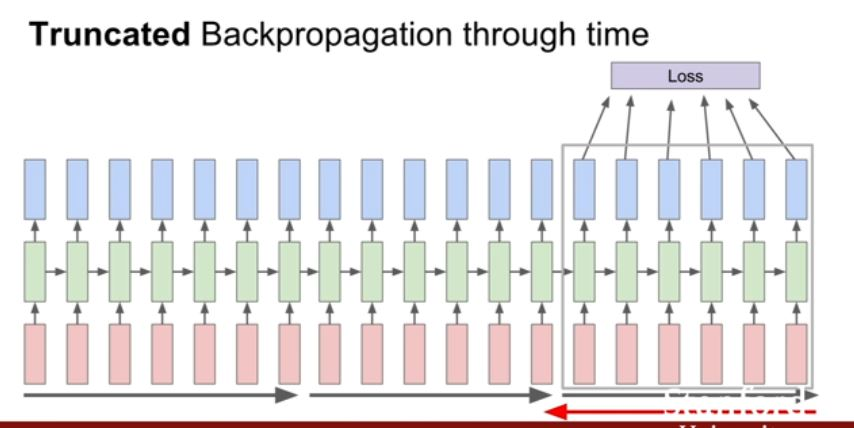

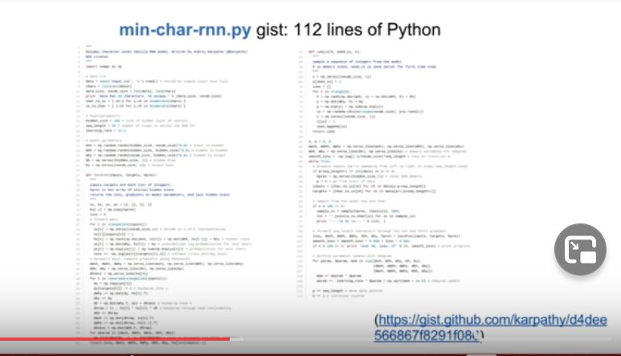

- Here, the idea is that, even though our input sequence is very, very long, and even potentially infinite, what we'll do is that during, when we're training the model, we'll step forward for some number of steps, maybe like a hundred is kind of a ballpark number that people frequently use, and we'll step forward for maybe a hundred steps, compute a loss only over this sub sequence of the data, and then back propagate through this sub sequence, and now make a gradient step. And now, when we repeat, well, we still have these hidden states that we computed from the first batch, and now, when we compute this next batch of data, we will carry those hidden states forward in time, so the forward pass will be exactly the same. But now when we compute a gradient step for this next batch of data, we will only backpropagate again through this second batch. Now, we'll make a gradient step based on this truncated backpropagation through time. This process will continue, where now when we make the next batch, we'll again copy these hidden states forward, but then step forward and then step backward, but only for some small number of time steps. So this is, you can kind of think of this as being an alegist who's the cast at gradient descent in the case of sequences. Remember, when we talked about training our models on large data sets, then these data sets, it would be super expensive to compute the gradients over every element in the data set. So instead, we kind of take small samples, small mini batches instead, and use mini batches of data to compute gradient stops in any kind of image classification case. 

- we kind of take small samples, small mini batches instead, and use mini batches of data to compute gradient stops 

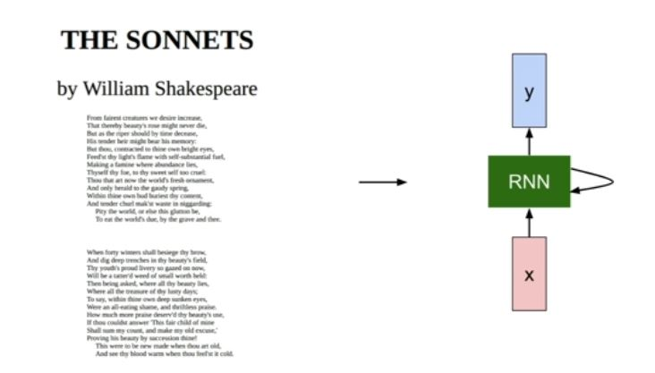

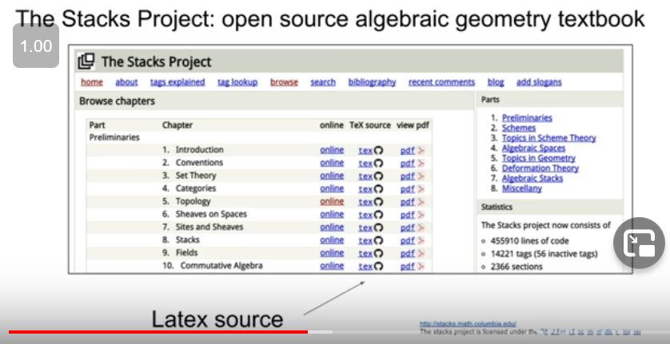

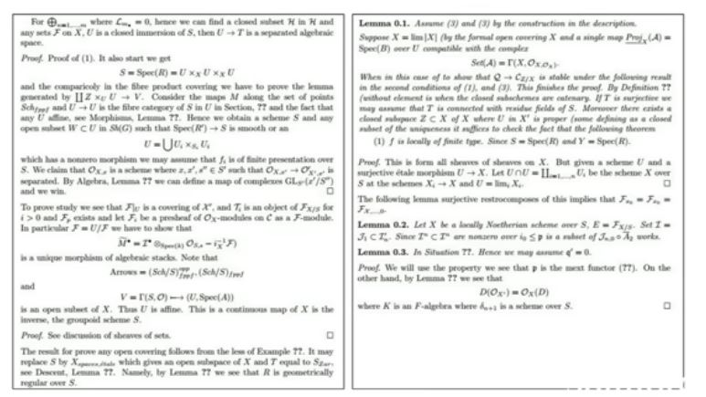

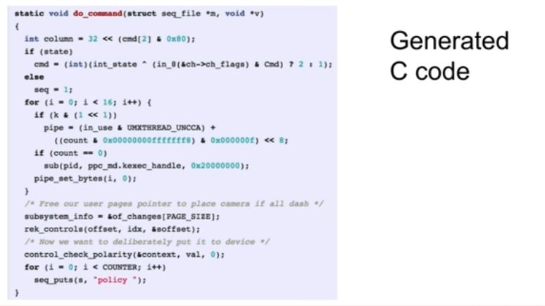

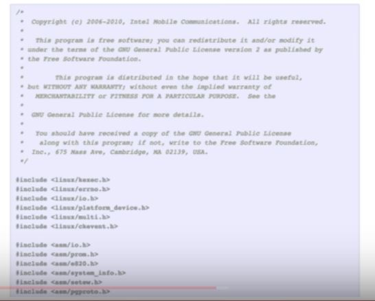

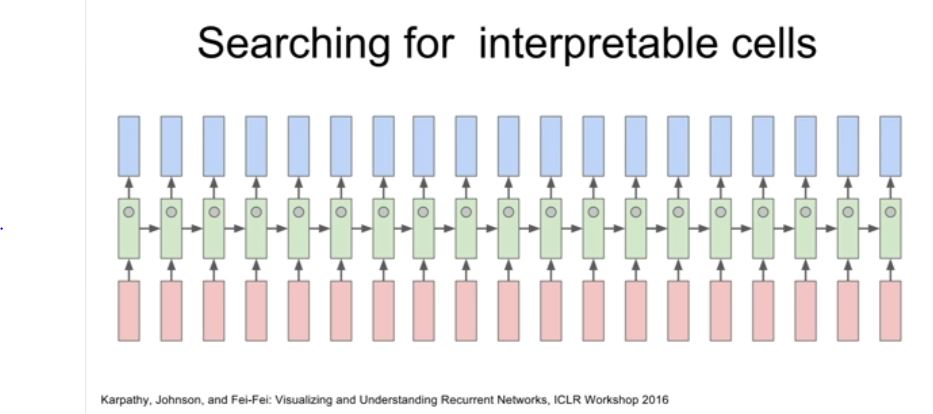

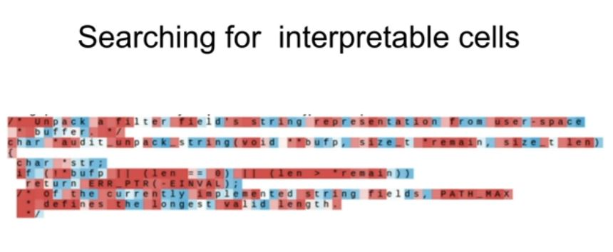

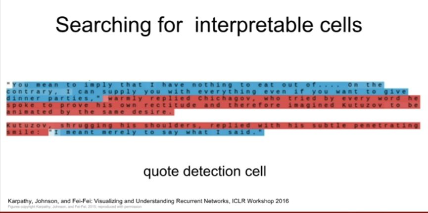

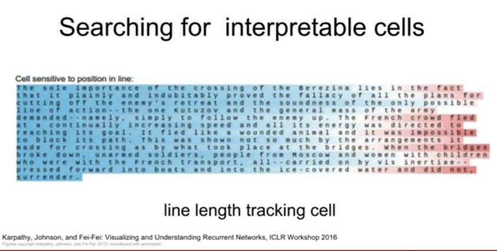

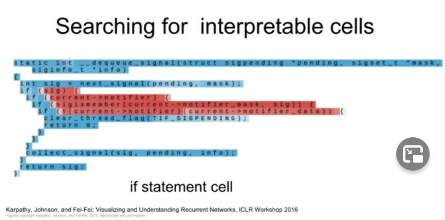

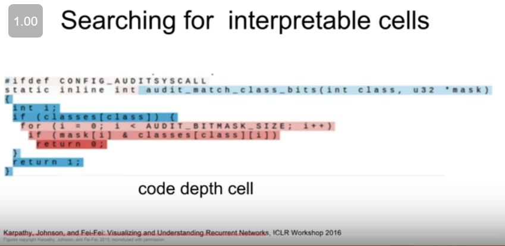

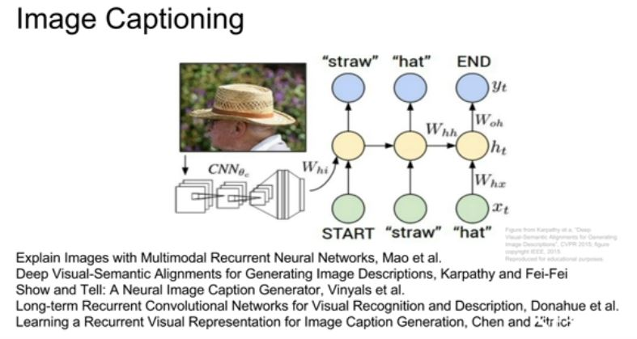

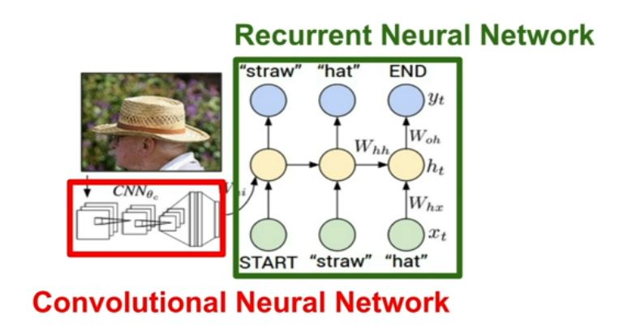

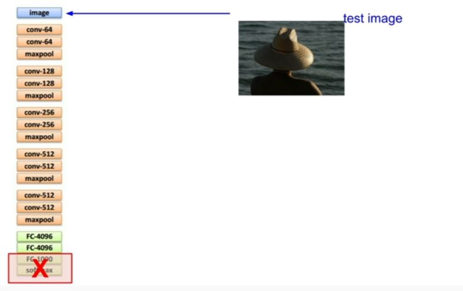

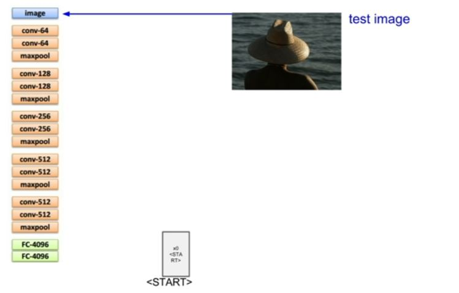

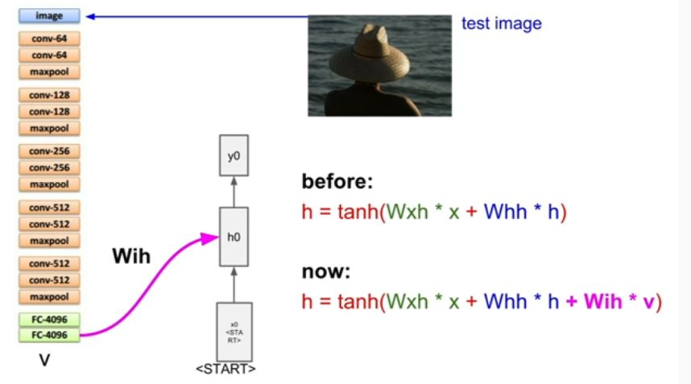

We transfer the image information using the wih*v

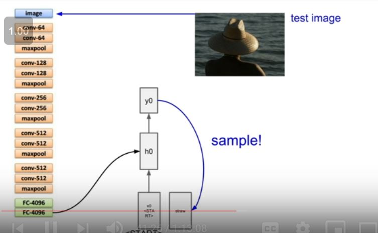

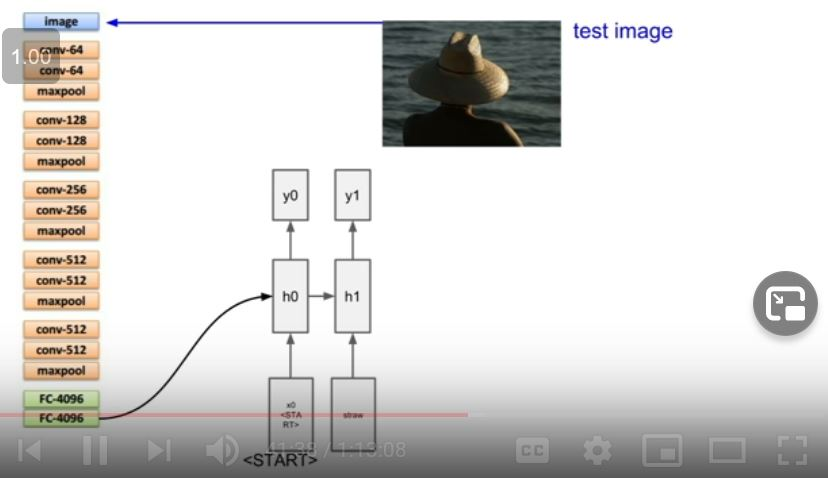

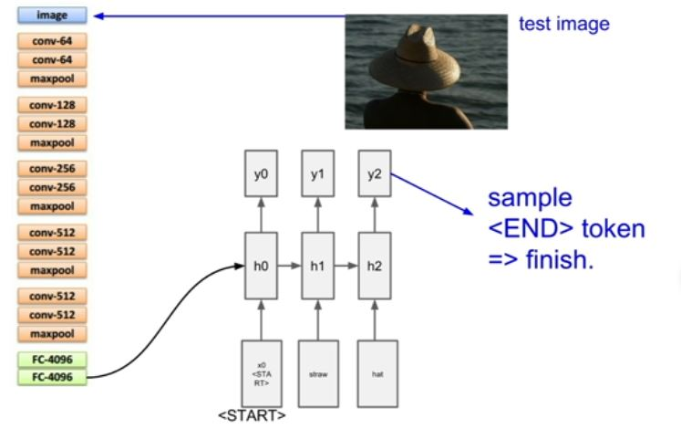

We stop generation once we sample the special ends token, which kind of corresponds to the period at the end of the sentence. Then once the network samples this ends token, we stop generation and we're done and we've gotten our caption for this image. And now, during training, we trained this thing to generate, like we put an end token at the end of every caption during training so that the network kind of learned during training that end tokens come at the end of sequences. So then, during test time, it tends to sample these end tokens once it's done generating. 

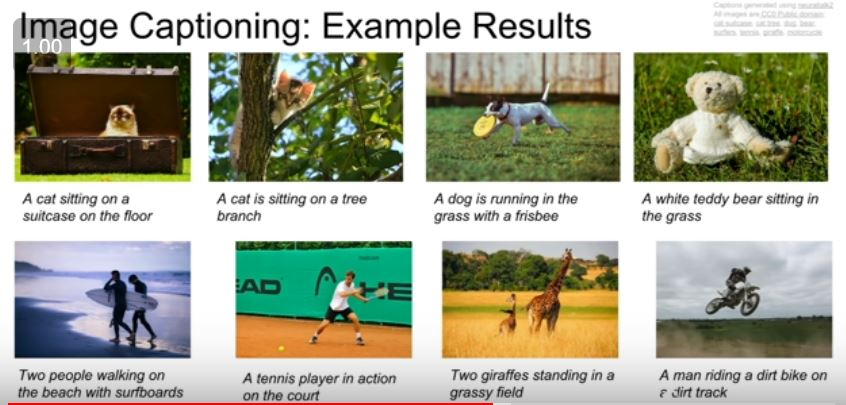

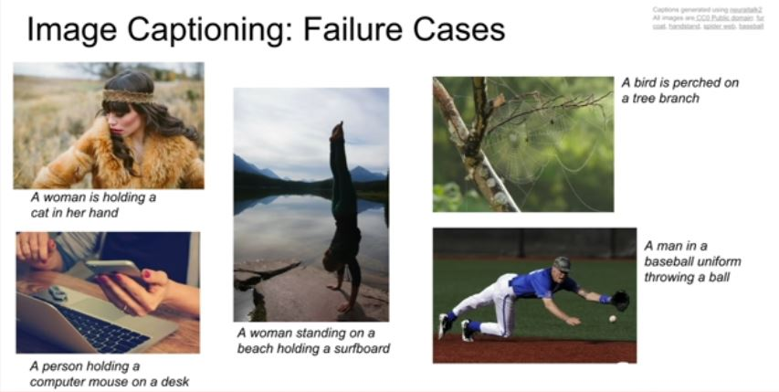

