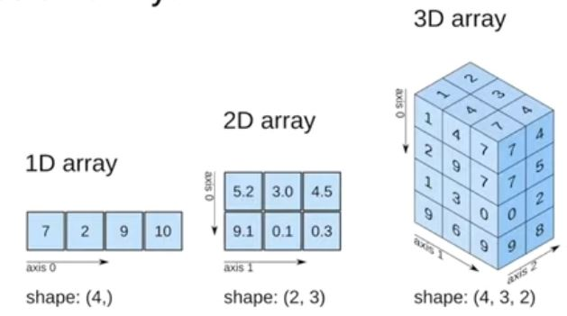
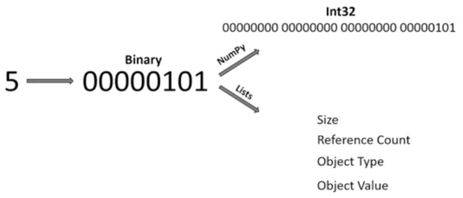
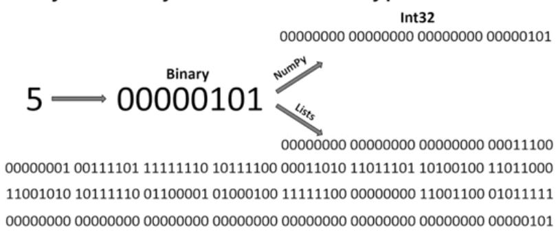
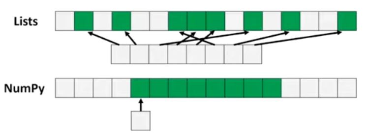

Source - freeCodeCamp
         https://www.youtube.com/watch?v=QUT1VHiLmmI

## What is Numpy?
Can use numpy to store data in multi-dimensional array
<!--|| this is commented this is how to add images-->

## How are Lists different from Numpy?
Lists are very slow whereas numpy is very fast

So Why are lists slow and numpy fast?
Because Numpy uses fixed type

Comparing the two images above we can notice that a single integer in numpy takes a lot less memory than a single integer in a list , so numpy is faster because numpy takes less memory.

Another reason is there is no type checking when iterating through objects i.e...., in a python list we can have a int , float, string , char, double etc so we have to typecheck but in numpy we don't.

Third reason is, numpy uses contiguous memory.

Computers is SIMD Vector processing
SIMP - single instruction multiple data
benefit of this is that if we have contiguous memory we can do multiple operations in the block rather than ust doing one.

Effective cache utilization
