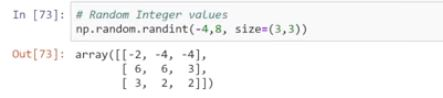

Source - freeCodeCamp
         https://www.youtube.com/watch?v=QUT1VHiLmmI

Code from the video - https://github.com/KeithGalli/NumPy

## What is Numpy?
Can use numpy to store data in multi-dimensional array
<!--|| this is commented this is how to add images-->


## How are Lists different from Numpy?
Lists are very slow whereas numpy is very fast

So Why are lists slow and numpy fast?
Because Numpy uses fixed type


Comparing the two images above we can notice that a single integer in numpy takes a lot less memory than a single integer in a list , so numpy is faster because numpy takes less memory.

Another reason is there is no type checking when iterating through objects i.e...., in a python list we can have a int , float, string , char, double etc so we have to typecheck but in numpy we don't.

Third reason is, numpy uses contiguous memory.


Computers is SIMD Vector processing
SIMP - single instruction multiple data
benefit of this is that if we have contiguous memory we can do multiple operations in the block rather than ust doing one.

Effective cache utilization
-Though both uses cache in list we have to do longer memory look ups numpy its faster 

## How are Lists different from numpy?


## Application of NumPy?
- Mathematics (MATPLAB Replacement)
- Plotting (Matplotlib)
- Backend (Pandas....etc)
- Machine Learning

Code from the video - https://github.com/KeithGalli/NumPy

## install numpy
1. Go to terminal and type
```
pip install numpy
```

## import numpy
```
import numpy as np
```
Can use any name instead np but by convention use np

## The Basics

### Initialization
```
a = np.array([1,2,3])
```
output - array([1,2,3])
```
print(a)
```
output - [1 2 3]


### Get Dimension
```
a.ndim
```
output - 1

### Get Shape
```
b.shape
```
output - (2,3)

### Get type
```
a.dtype
```
output - dtype('int32')

### if we want to specify what type of dtype then -
```
a = np.array([1,2,3], dtype = 'int16')
a.dtype
```
output - dtype('int16')

### Get memory size
```
a.itemsize
```
output - for int32 - 4
         for int16 - 2 

### Get total size
```
a.size*a.itemsize
```
or
```
a.nbytes
```

## Accessing/changing specific elements, rows, columns, etc

### Get a specific element [r,c]
```
a[1,5]
```
numpy array index starts from 0
a.shape -> (2,7)
We can also do
```
a[1,-2]
```

### Get a specific row
a[0, :]

### Get a specific column
a[:, 2]

### Getting a little more fancy [startindex:endindex:stepsize]
```
a[0, 1:6:2]
```
prints all element in row 0 starting from index 1 to index 5 in a step of 2

```
a[0, 1:6:-2]
```
this does not work because the steps goes backward and no end point so gives error

```
a[0, 1:-1:2]
```
can be used as an alternative

### Change something
```
a[1,5] = 20
a[:,2] = [1,2]
```

### 3-d example


eg -  b[:, 0, :]


## Initializing Different Types of Arrays

### All 0s matrix
```
np.zeros((2,3,3))
```
Forms a 3 dimensional array

### All 1s matrix
```
np.ones((4,2), dtype='int32')
```

### Any other number
```
np.full((2,2), 99, dtype= 'float32')
```
forms an 2x2 array with only 99

### Any other number (full_like)
```
np.full(a, 4)
```
makes an array of shape a with all element value equals to 4

### Random decimal numbers
```
np.random.rand(2,4)
```
or
```
np.random.random_sample(a.shape)
```

### Random Integer values
np.random.randint(7, size=(3,3))




### The Identity matrix
```
np.identity(5)
```

### Repeat an array


### Activity


```
import numpy as np
a = np.ones((5,5), dtype='int16')
b= np.zeros((3,3), dtype='int16')
b[1,1] = 9
a[1:4,1:4] = b
print(a)
```

a[1:4, 1:4] can also be written as a[1:-1, 1:-1]

### Becarful when copying arrays!!


here if we change b, a will change too because a and b are pointing to the same memory block , a and b are just pointers

To solve this problem we can use 


## Mathematics
```
a+2
```
adds 2 to each element

Can do operations +,-,/,*,**

```
a+b
```

### Take sin of all values
```
np.sin(a)
```


## Linear Algebra
a -> (2,3)
b -> (3,2)

Here a*b will not work because they are not same size

#### Instead can use matrix multiplication
```
np.matmul(a,b)
```

### Find the determinant
```
c= np.identity(3)
np.linalg.det(c)
```


## Satistics
```
np.min(a)
np.min(a, axis=0)
np.min(a, axis=1)
```

```
np.max(a)
np.max(a, axis=0)
np.max(a, axis=1)
```

```
np.sum(a)
```

## Reorganizing Arrays

### Reshaping Array


This will work as long as the shape we are trying to reshape the array into has the same quantity of elements
For example - (4,2)= 4*2 =8 elements it can be reshaped into (8,1),(1,8),(2,4),(2,2,2)
it will not work for (2,3)

### Vertically Stacking vectors


### Horizontal stacking vectors


## Load Data from File

Notes-
```
a.astype('int16')
```
astype copies all the data to whatever format we want


## Boolean Masking and Advanced Indexing


np.any(a>50, axis=0) returns true if their is any value which is greater than 50 in the columns


np.all(a>50, axis=0) returns true if all the values in the column is greater than 50 in the columns else false


## Question

