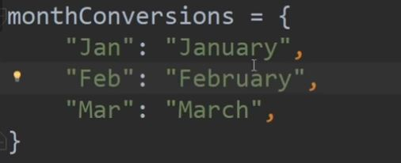

Source - freeCodeCamp - https://www.youtube.com/watch?v=rfscVS0vtbw&list=RDCMUC8butISFwT-Wl7EV0hUK0BQ&start_radio=1

# Python for beginners

## Concatenate
```
age = "9"
print("Age" + age)
```
Not -: By the '+' operator we can only concatanate strings together cannot with different data type

## Strings and all cool functions should remember
```
string s = "hello"
```
- s.lower() - converts all to lower case
- s.upper() - converts all to upper case
- s.isupper() - returns true if all characters is uppercase
- s.upper().isupper() - converts s to uppercase before than checks with isupper()
- len(s) - returns length of s
- s.index("G") - returns index of G in s
    can also give words will return the index of the first letter found 
    s.index("lo")
    if we give something that's not in the string then it will give error
- s.replace("he", "lolol")

## Cool functions for numbers
- abs(-5) -> returns 5
- pow(3, 2) -> 3 to the power 2
- max(4,6)
- round(3.2)
- floor(3.7) - returns the greatest nearest integer which is greater than 3.7 that is returns 4
- ciel(3.7) - returns the lowest nearest integer which is less than 3.7 that is returns 3
- sqrt(36)

## Getting input from user
- name = input("Enter your name:")

## Some Cool Lists function
a and b are lists
a = []
- a.extend(b) -> merges a and b 
- a.append(element) -> inserts element to the end of the list
- a.insert(1, "Hi") -> inserts hi in index 1 of a
- a.remove("Hi") -> removes hi from list
- a.clear() -> gets rid of all element in the list gives an empty list
- a.pop() -> removes the last element in a
- a.index("Hi") -> gives the index of "Hi" if exist in list a or will give error
- a.count("Hi") -> counts the number of times "Hi" shows up in the list
- a.sort() -> sorts list in ascending order
- a.reverse() -> reverses the list
- b= a.copy() -> copies a to b

## Tuples
a = (0,9)
a[0] and a[1] gives 0 and 9
Tuples can't be change its immutable it can't handle value assignment

## Functions
```
def <function name>:
    <function body>
```

Example
```
def sayhi:
    print("Hi")

sayhi()
```

## Dictionaries
