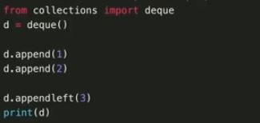
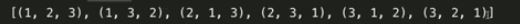
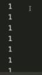

Source - freeCodeCamp 
- https://www.youtube.com/watch?v=rfscVS0vtbw&list=RDCMUC8butISFwT-Wl7EV0hUK0BQ&start_radio=1
- https://www.youtube.com/watch?v=HGOBQPFzWKo&list=RDCMUC8butISFwT-Wl7EV0hUK0BQ&index=2

# Python for beginners

## Concatenate
```
age = "9"
print("Age" + age)
```
Not -: By the '+' operator we can only concatanate strings together cannot with different data type

## Strings and all cool functions should remember
```
Strings: ordered, immutable, text representation
string s = "hello"
```
- s.lower() - converts all to lower case
- s.upper() - converts all to upper case
- s.isupper() - returns true if all characters is uppercase
- s.upper().isupper() - converts s to uppercase before than checks with isupper()
- len(s) - returns length of s
- s.index("G") - returns index of G in s
    can also give words will return the index of the first letter found 
    s.index("lo")
    if we give something that's not in the string then it will give error
- s.replace("he", "lolol")
- slicing works the same
- '+' can be used to concatanate
- for i in s:
- if 'w' in s:
- a = s.strip() -> removes the whitespace 
- s = s.strip() -> valid
- s.startswith('Hello') -> returns boolean
- s.endswith('W') 
- s.find('o') -> returns index of the first o
- s.count('o')
- immutable objects can be reassigned
- my_list = s.split(" ") -> by default the delimeter is " " we can choose other for delimeter
- new_string = ' '.join(my_list) -> change list to string 
- there are two ways to format a string 
    - % , .format(), f-strings


Fstrings are better faster


## Cool functions for numbers
- abs(-5) -> returns 5
- pow(3, 2) -> 3 to the power 2
- max(4,6)
- round(3.2)
- floor(3.7) - returns the greatest nearest integer which is greater than 3.7 that is returns 4
- ciel(3.7) - returns the lowest nearest integer which is less than 3.7 that is returns 3
- sqrt(36)

## Getting input from user
- name = input("Enter your name:")

## Some Cool Lists function
```
Lists: orderred, mutable, allows duplicable elements
List allows different data type and duplicate elements
```

a and b are lists
a = []
- a.extend(b) -> merges a and b 
- a.append(element) -> inserts element to the end of the list
- a.insert(1, "Hi") -> inserts hi in index 1 of a
- a.remove("Hi") -> removes hi from list
- a.clear() -> gets rid of all element in the list gives an empty list
- a.pop() -> removes the last element in a
- a.index("Hi") -> gives the index of "Hi" if exist in list a or will give error
- a.count("Hi") -> counts the number of times "Hi" shows up in the list
- a.sort() -> sorts list in ascending order
- a.reverse() -> reverses the list
- b= a.copy() -> a=b copies only the pointers use this instead it copies a to b
- alternatives for a.copy
    - b = list(a)
    - b = a[:]
- new_list = sorted(my_list) -> creates a new_list out of my list but does not change my_list

#### Usefull tricks
- mylist = [0]*5 -> creates [0, 0, 0, 0, 0]
- a+b -> concates two list
- slicing 
    - a[1:5]
    - a[1:]
    - a[1::2] 2 is the step index by default it is one goes from index 1 to the end with step 2
    - a[::1] goes from beginning to the end with step 1
    - a[::-1] -> nice trick to reverse a list

#### List comprehensions
- b = [i*i for i in a]

## Tuples
```
Tuple: ordered, immutable, allows duplicate element
```
a = (0,9)

a[0] and a[1] gives 0 and 9

Tuples can't be change its immutable it can't handle value assignment

- a = ("hi",9,0,6)
- a = "hi",9,0,6
- a = ("hi") -> not a tuple
- a = ("hi", ) -> a tuple
- a = tuple(["hi",9,0,6])

Index logic is same as list -ve indexes also works

```
for i in a:
    print(a)
```

- if "hi" in a:
    print(yes)
- len(a) -> gives number of element
- a.count("hi") -> count the elements if not gives 0
- a.index("hi") -> return first occurance of the element
- can easily convert list to a tuple and vice versa with list and tuple fuctions   
- slicing same as list
- s,t,w,x = a -> a is a tuple the number of elements in RHS should be equal to LHS
- or can use s,*t,x = a -> if we just want first and last element in between elements are converted to list
- import sys
    sys.getsizeof(a) -> works with list too
- list is larger than tuple , tuple are more efficient to create and iterate compared to list

## Functions
```
def <function name>:
    <function body>
```

Example
```
def sayhi:
    print("Hi")

sayhi()
```

## Dictionaries
```
Dictionary: key-value pairs, Unordered, Mutable
```


dict = {key:value}

my_dict = dict(key:value)

print(monthConversions["Nov"])

print(monthConversions.get("Luv", "Not a valid key")) -> we can set a default value if the key not found using get function, second argument is the default value

- dict.pop("Jan") -> removes the item specified
- dict.popitem() -> removes the last inserted item
- if --- in --- : can be used
- try:
    print(my_dict["name"])
  except:
    print("error")
- for key in my_dict.keys():
- for values in my_dict.values():
- for key,value in my_dict.items():
- dictc = dict.copy()
- dict.update(a) -> dict gets overwritten by a
- lists cannot be used as a key because it is mutable that is can be changed after creation and is not hashable

## Sets
```
sets: unordered, mutable, no duplicates
```
- myset = {1,2,3,4,3}
- myset = set("Hello")
- myset = set() -> empty set
- myset = {} -> empty dict
- myset.add() -> adds element
- myset.remove(4) -> raises keyerror if not element found
- myset.discard(4) -> unlike remove does not give any error
- myset.clear() -> empties the set
- myset.pop() -> returns arbitary value of our set and also returns it
- for i in myset: pass
- if elem in myset: pass
- a = b.union(c)
- a = b.intersection(c)
- a = b.difference(c)
- a = b.symmetric_difference(c) -> return all the elements in set a and set b but not the elements in both sets
- a.update(b)
- a.intersection_update(b)
- a.difference_update(b)
- a.symmetric_difference_update(b)
- a.issubset(b) -> returns boolean
- a.issuperset(b)
- a.isdisjoint(b)
- a = b.copy()
- a = set(b)
- A frozenset is a immutable version of normal set
- a = frozenset([1,2,3,4,5])

## While Loop


## Comments
'#' or ''' dsdf'''

## Try and except
```
try:
    blah blah i mean write the code here!
except ZeroDivisionError as err:
    print("Divided by xero")
    print(err)
except:
    print("invalid input")
```
Best Practice is except the specific errors

## Reading From Files
file = open("file.txt", "r") -> r stands for read, w is for write, a stands for append info at the end of the file you can't change anything in the file in this mode but can add new info, r+ is read and write

- file.readable() -> returns a boolean value tells whether or not we can read from the file

- file.read() -> gives all the file content

- file.readline() -> reads a line from the file

- file.readlines() -> this takes all the lines in the file and puts it in an array or list

file.close()

## Writing in file
file = open("file.txt", "a")

- file.write("yo") -> writes in the end of the file in a mode in w mode it replaces all the file content with yo, it creates another file if file name doesn't exist

file.close()

## Modules and Pip
Module is just a python file that we can import in our current python file


Some useful phython modules-


pip is a program

pip install <--->
pip uninstall <--->

## Classes and Objects
```
class student:
    def __init__(self,name,gpa):
        self.name = name
        self.gpa = gpa

stu1 = student("Eren",3.9) --> class object

stu1.name
stu1.gpa
```

## Inheritance
```
class chef:
    pass

class indianchef(chef):
    pass
```

A python interpreter can be used for test out same codes just write python in command promt or terminal

# Python intermediate

## Collection module
```
collections: Counter, namedtuple, OrderedDict, defaultdict, deque
```
### Counter


returns a dictionary, list, tuple according to the method used

- my_Counter.items() -> returns dictionary
- my_Counter.keys() -> returns dictionary
- my_Counter.values() -> returns dictionary
- my_Counter.most_common(1) -> gives ('a',5) returns a list with tuples in it
- my_Counter.most_common(1)[0][0] -> returns 'a'
- my_counter.elements() -> gives an iterable of elements repeating each elements as many times it counts
- list(my_counter.elements()) -> gives a list of all elements

### namedtuple

easy to create and light weight object type similar to a struct


creates a class Point with values x and y

### OrderedDict
ordereddict are normal dict except they remember the order in which items were inserted

this is not that important in new python version as the dict does the same but can be usefull in older version before 3.7


### DefaultDict
Its also similar to the original dictionary with the only difference is that it comes with a default value if the key hasn't been set yet 


### deque pronounced as deck? -_-!! thought it was de - q

deque is a double ended queue 



- d.pop() -> right
- d.popleft()
- d.clear()
- d.extend([1, 2, 3]) -> right
- d.extendleft([4, 5, 6])
- d.rotate(1) -> shifts or rotates all element 1 place to the right , if want to rotate left give negative integer as argument like -1, -2 etc

## itertools

```
itertools: product, permutations, combinations, accumulate, groupby, and infinite iterators
```

it is a collection of tools for handling iterators

interators are datatype that can be used in a for loop

### product
computes cartesian product of the iterables


### permutations
returns all possible inputs of an ordering





### combinations


### combinations_with_replacement


### accumulate
makes an iterator that returns accumalated sums

#### Add each element and accumulate


#### Multiply each element and accumulate


#### accumulate with max operator


### groupby
groupby functions makes an iterator that returns keys in groups from an iterable(not clear enough see examples)


#### infinite iterators
```
count, cycle, repeat
```


count will start from 10 and go to infinity the above will create an infinite loop unless a break is added

[failed to upload](./images/python/img49.JPG)


this will create an infinite loop that will cycle the array 1,2,3,1,2,3,1,2,3.................




it will also repeat the number given to it as argument infinite times